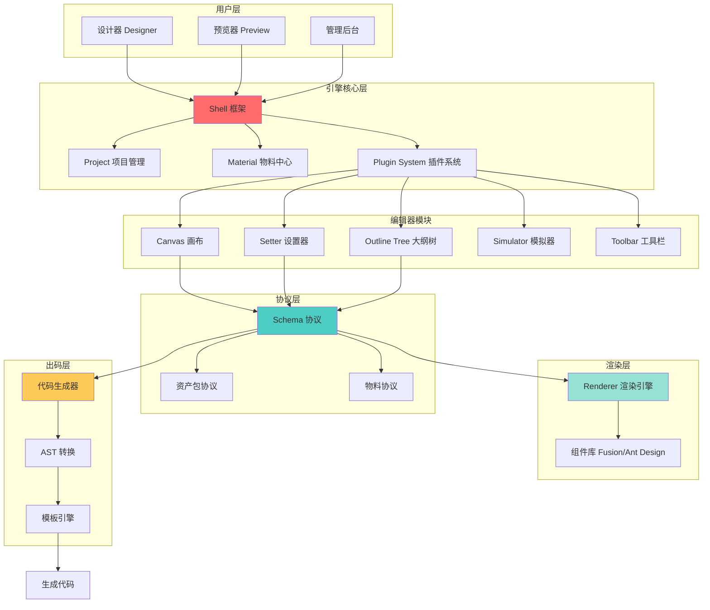
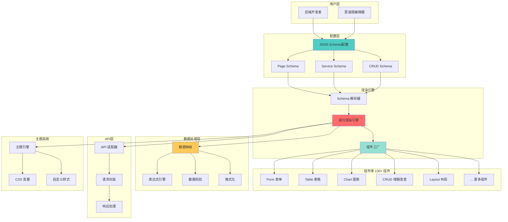
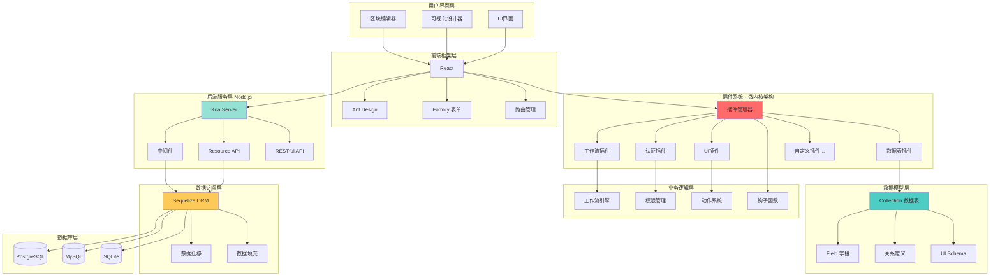
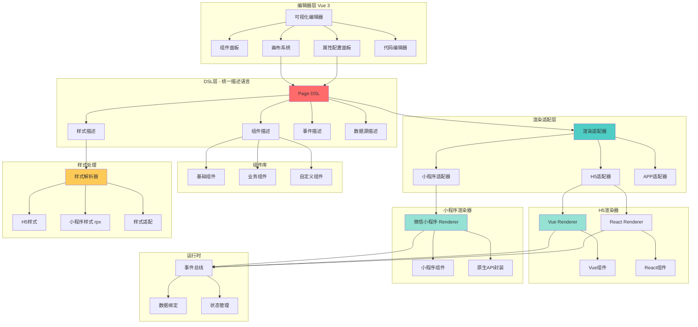
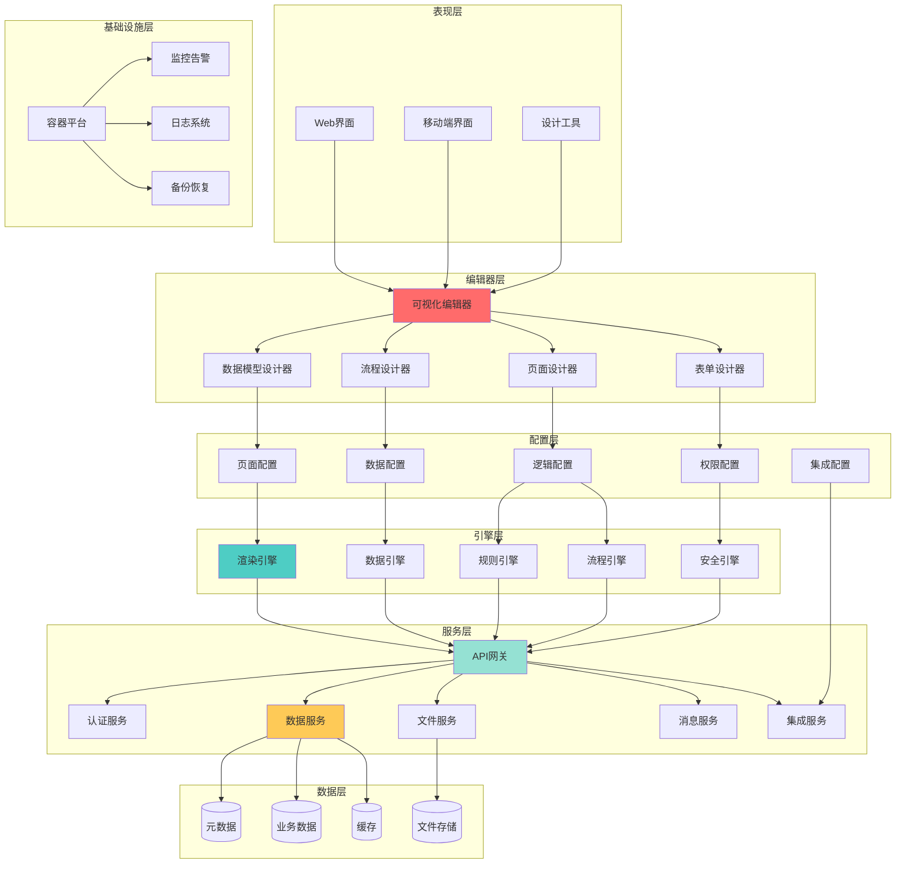
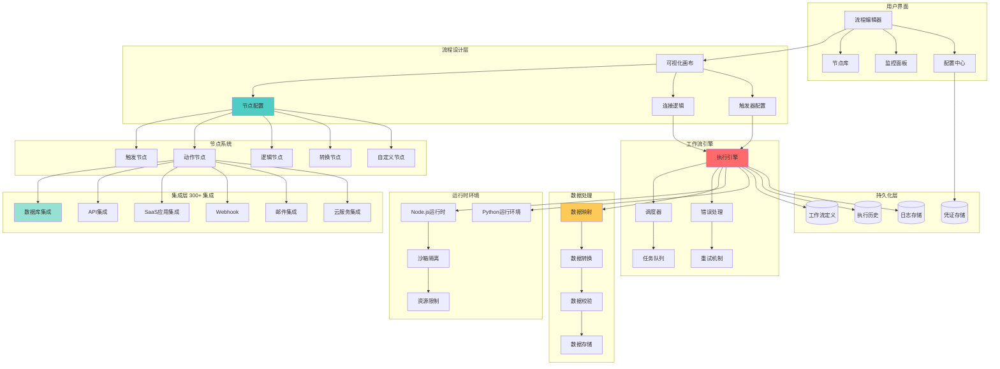
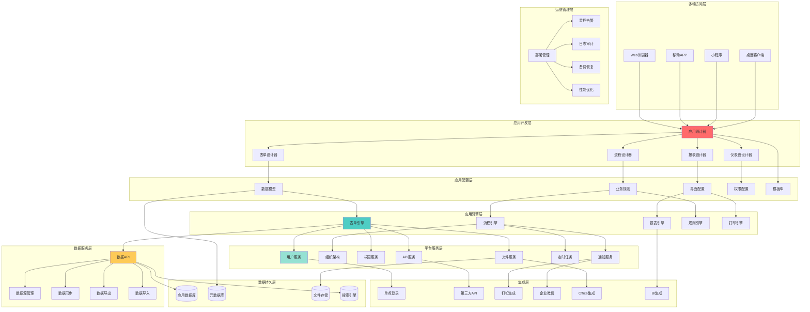
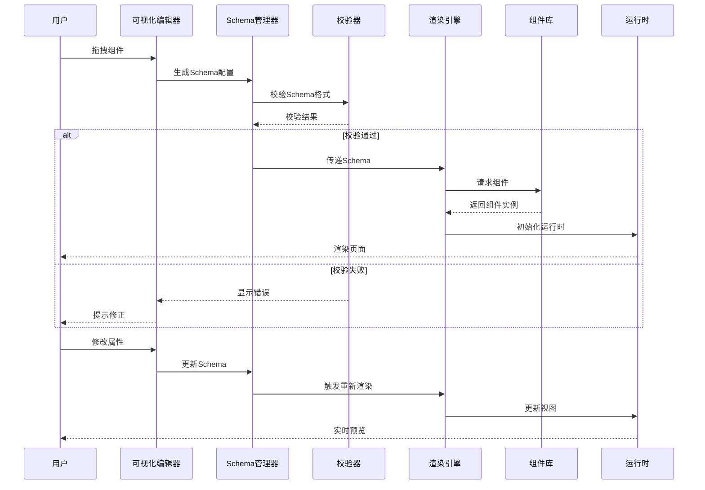

# 低代码平台市场调研报告

## 📋 报告摘要

本报告基于 [awesome-lowcode](https://github.com/taowen/awesome-lowcode) 项目的资源汇总，对国内外主流低代码平台进行了全面深入的调研分析。报告涵盖了 70+个低代码平台，200+篇技术文章，从产品分类、技术架构、企业实践、核心技术、设计哲学等多个维度进行剖析。

**核心发现**:

- 低代码平台可分为**页面搭建类**、**全栈应用类**、**工作流自动化类**三大类
- 阿里、腾讯、百度等大厂均有成熟的低代码实践经验
- Schema 协议设计是低代码平台的核心竞争力
- No Code、Low Code、Pro Code 各有适用场景，需根据团队能力和业务需求选择
- 低代码不会取代程序员，而是让开发更高效

**报告价值**:

- ✅ 帮助企业快速了解低代码市场现状
- ✅ 为技术选型提供决策依据
- ✅ 深入理解低代码平台技术架构
- ✅ 学习大厂低代码实践经验
- ✅ 掌握低代码平台设计哲学

---

## 📑 目录

- [一、主流低代码平台分类概览](#一主流低代码平台分类概览)
  - [1.1 页面搭建类](#11-页面搭建类)
  - [1.2 全栈应用类](#12-全栈应用类)
  - [1.3 工作流自动化类](#13-工作流自动化类)
  - [1.4 其他开源方案](#14-其他开源方案)
- [二、各平台深度分析](#二各平台深度分析)
  - [2.1 阿里低代码引擎](#21-阿里低代码引擎-lowcode-engine)
  - [2.2 百度 amis](#22-百度-amis)
  - [2.3 腾讯 TMagic Editor](#23-腾讯-tmagic-editor)
  - [2.4 NocoBase](#24-nocobase---全栈低代码开源方案)
  - [2.5 Appsmith](#25-appsmith---开源全栈低代码)
  - [2.6 阿里-云凤蝶](#26-阿里-云凤蝶)
  - [2.7 葡萄城-活字格](#27-葡萄城-活字格)
  - [2.8 ivx](#28-ivx---可视化开发语言)
  - [2.9 网易 CodeWave](#29-网易codewave智能开发平台)
  - [2.10 国外商业低代码平台](#210-国外商业低代码平台)
- [三、平台分类对比总结](#三平台分类对比总结)
  - [3.1 按技术能力分类](#31-按技术能力分类)
  - [3.2 技术选型决策树](#32-技术选型决策树)
  - [3.3 关键评估维度对比](#33-关键评估维度对比)
- [四、行业趋势与洞察](#四行业趋势与洞察)
  - [4.1 低代码平台发展趋势](#41-低代码平台发展趋势)
  - [4.2 核心技术关注点](#42-核心技术关注点)
  - [4.3 开源 vs 商业选择](#43-开源-vs-商业选择)
- [五、调研结论与建议](#五调研结论与建议)
  - [5.1 不同场景的推荐方案](#51-不同场景的推荐方案)
  - [5.2 开源项目学习路线](#52-开源项目学习路线)
  - [5.3 下一步行动建议](#53-下一步行动建议)
- [六、企业实践案例分析](#六企业实践案例分析)
  - [6.1 阿里巴巴低代码实践](#61-阿里巴巴低代码实践)
  - [6.2 腾讯低代码实践](#62-腾讯低代码实践)
  - [6.3 百度低代码实践](#63-百度低代码实践)
  - [6.4 其他互联网大厂实践](#64-其他互联网大厂实践)
  - [6.5 垂直行业实践](#65-垂直行业实践)
  - [6.6 实践总结与启示](#66-实践总结与启示)
- [七、核心技术深度剖析](#七核心技术深度剖析)
  - [7.1 Schema 协议设计](#71-schema协议设计)
  - [7.2 渲染引擎设计](#72-渲染引擎设计)
  - [7.3 数据流管理](#73-数据流管理)
  - [7.4 可视化编辑器架构](#74-可视化编辑器架构)
  - [7.5 出码技术](#75-出码技术)
  - [7.6 性能优化实践](#76-性能优化实践)
  - [7.7 协同编辑技术](#77-协同编辑技术)
- [八、理论基础与设计哲学](#八理论基础与设计哲学)
  - [8.1 人机交互设计原则](#81-人机交互设计原则)
  - [8.2 No Code vs Low Code vs Pro Code](#82-no-code-vs-low-code-vs-pro-code)
  - [8.3 可逆计算理论](#83-可逆计算理论)
  - [8.4 领域驱动设计（DDD）在低代码中的应用](#84-领域驱动设计ddd在低代码中的应用)
- [附录：重要资源链接](#附录重要资源链接)

---

## 一、主流低代码平台分类概览

### 1.1 页面搭建类

专注于前端页面的可视化搭建，通过拖拽组件快速生成界面。

| 平台                | 厂商        | 开源 | 定位                 | 核心特点                                         |
| ------------------- | ----------- | ---- | -------------------- | ------------------------------------------------ |
| LowCode Engine      | 阿里巴巴    | ✅   | 企业级低代码引擎     | 提供完整的物料体系、协议规范，支持高度定制       |
| amis                | 百度        | ✅   | 前端低代码框架       | 纯 JSON 配置生成页面，学习成本低，适合后端开发者 |
| TMagic Editor       | 腾讯        | ✅   | 可视化页面搭建编辑器 | 支持跨端（H5/小程序），配置化驱动                |
| 云凤蝶              | 阿里巴巴    | ❌   | 中台页面搭建         | 媲美 Sketch 的自由画布，分层模型设计             |
| 飞冰                | 阿里巴巴    | ✅   | 前端研发解决方案     | 物料体系、工程配置、研发工具链一体化             |
| OpenTiny TinyEngine | 华为        | ✅   | 低代码引擎           | 企业级能力，支持 Vue/React 组件生态              |
| Retool              | Retool Inc. | ❌   | 内部工具快速搭建     | 专注企业内部管理系统，强大的数据源集成           |
| Appsmith            | Appsmith    | ✅   | 开源低代码应用构建   | 全栈能力，Git 版本管理，自托管友好               |
| 鲁班 H5             | 开源社区    | ✅   | H5 页面搭建          | 类似易企秀，支持活动页面快速搭建                 |
| 码良                | 运满满      | ✅   | 在线网页制作平台     | 高扩展性，组件化设计                             |

### 1.2 全栈应用类

从前端到后端、数据库的完整应用搭建能力。

| 平台          | 厂商         | 开源    | 定位           | 核心特点                                     |
| ------------- | ------------ | ------- | -------------- | -------------------------------------------- |
| 宜搭          | 阿里/钉钉    | ❌      | 企业应用搭建   | 与钉钉深度集成，表单、流程、报表一体化       |
| 飞书多维表格  | 字节跳动     | ❌      | 轻量化应用搭建 | 基于多维表格的应用构建，易用性强             |
| 活字格        | 葡萄城       | ❌      | 企业级低代码   | 专业开发者友好，类 Excel 设计体验            |
| 无远开发平台  | 无远         | ❌      | 专业开发者平台 | 代码与低代码混合开发，灵活度高               |
| 得帆云        | 得帆信息     | ❌      | 企业级低代码   | 连续获评最佳企业级低代码称号                 |
| 明道云        | 明道云       | 部分 ✅ | 企业协作平台   | 支持私有部署，提供免费社区版                 |
| 简道云        | 简道云       | ❌      | 零代码应用搭建 | 表单驱动，流程自动化                         |
| 轻流          | 轻流         | ❌      | 业务流程自动化 | 无代码流程搭建，业务人员可用                 |
| 织信 Informat | 织信         | ❌      | 企业数字化平台 | 生产制造领域实践丰富（君乐宝案例）           |
| 网易 CodeWave | 网易数帆     | ❌      | 智能开发平台   | AI 辅助开发，全生命周期管理                  |
| ivx           | ivx          | ❌      | 可视化开发语言 | 真正生成代码，程序员友好                     |
| Mendix        | Siemens      | ❌      | 企业级低代码   | Gartner 领导者象限，企业级功能完善           |
| OutSystems    | OutSystems   | ❌      | 专业低代码平台 | 全生命周期管理，支持复杂企业应用             |
| Bubble        | Bubble Group | ❌      | 无代码全栈平台 | 零代码门槛，可视化逻辑编排，适合非技术创业者 |
| NocoBase      | NocoBase     | ✅      | 开源全栈低代码 | 国产开源，插件化架构，支持私有化部署         |
| 华炎魔方      | 华炎魔方     | ✅      | 开源低代码平台 | 支持低代码 DevOps 协议                       |
| Appsmith      | Appsmith     | ✅      | 企业应用构建   | 32k+ stars，Git 同步，强大数据处理           |

### 1.3 工作流自动化类

专注于业务流程自动化和系统集成。

| 平台              | 厂商        | 开源 | 定位             | 核心特点                               |
| ----------------- | ----------- | ---- | ---------------- | -------------------------------------- |
| 飞书自动化        | 字节跳动    | ❌   | 企业流程自动化   | 与飞书办公套件深度集成，无代码流程编排 |
| n8n               | n8n GmbH    | ✅   | 开源工作流自动化 | 节点式编排，支持 300+ 集成，可自托管   |
| Zapier            | Zapier Inc. | ❌   | SaaS 自动化连接  | 6000+ 应用集成，易用性极佳             |
| Make (Integromat) | Make        | ❌   | 可视化自动化     | 图形化流程设计，场景化模板丰富         |

### 1.4 其他开源方案

| 平台           | Star 数 | 语言栈           | 定位           | 核心特点                            |
| -------------- | ------- | ---------------- | -------------- | ----------------------------------- |
| Appsmith       | 32k+    | Java + React     | 企业应用构建   | Git 同步，自定义 JS，强大的数据处理 |
| ToolJet        | 28k+    | Node.js + React  | 内部工具平台   | 类 Retool 开源替代，拖拽式 UI 构建  |
| Budibase       | 21k+    | Node.js + Svelte | 全栈低代码     | 快速构建内部工具，支持多数据源      |
| amis           | 16.5k+  | React + TS       | 前端低代码框架 | 百度出品，Schema 驱动，组件丰富     |
| LowCode Engine | 13.8k+  | React + TS       | 低代码引擎     | 阿里出品，协议标准，企业级架构      |
| NocoBase       | 10k+    | Node.js + React  | 全栈低代码     | 国产开源，插件化，数据模型驱动      |
| ILLA Builder   | 10k+    | Go + React       | 开源低代码     | 实时协作，AI 集成，现代化架构       |
| 鲁班 H5        | 6k+     | Vue              | H5 页面搭建    | 类易企秀，活动页面快速搭建          |
| TMagic Editor  | 4k+     | Vue 3 + TS       | 页面搭建编辑器 | 腾讯出品，跨端支持（H5/小程序）     |
| 码良           | 4k+     | -                | 网页制作平台   | 运满满出品，高扩展性设计            |
| brick-design   | 3k+     | React            | 可视化编辑器   | 组件拖拽，实时预览                  |
| sparrow-js     | 1k+     | -                | 页面搭建工具   | 实时输出前端代码                    |
| Mall-Cook      | 1k+     | Vue              | 电商页面搭建   | 商城页面可视化搭建                  |
| form-generator | 5k+     | Vue + Element    | 表单设计器     | 表单设计及代码生成                  |
| Formily        | -       | React/Vue        | 表单解决方案   | 阿里出品，下一代表单方案            |

---

## 二、各平台深度分析

### 2.1 阿里低代码引擎 (LowCode Engine)

**官网**: https://lowcode-engine.com/  
**GitHub**: https://github.com/alibaba/lowcode-engine (13.8k+ stars)

#### 定位与目标用户

- **定位**: 企业级低代码研发协同解决方案
- **目标用户**: 企业内部开发平台，需要深度定制的场景
- **适用场景**: 大型企业内部工具、中后台系统快速搭建

#### 核心功能

1. **物料体系**: 组件、区块、页面模板的完整生态
2. **协议规范**: 统一的 Schema 协议标准
3. **插件机制**: 高度可扩展的插件系统
4. **出码能力**: 支持导出高质量的 React 代码
5. **生态集成**: 与 Fusion Design、Ant Design 等组件库集成

#### 技术架构

- **前端**: React + TypeScript
- **核心模块**:
  - Designer (设计器): 拖拽、画布、大纲树
  - Setter (设置器): 属性配置面板
  - Simulator (模拟器): 画布渲染器
  - Renderer (渲染器): 生产环境渲染引擎
  - Plugin (插件): 扩展能力

#### 优势

- ✅ 协议标准完善，社区认可度高
- ✅ 阿里内部大规模实践验证
- ✅ 文档完善，生态丰富
- ✅ 支持物料市场和版本管理
- ✅ 代码质量高，适合二次开发

#### 局限性

- ❌ 学习曲线较陡，上手需要时间
- ❌ 只专注前端层，不包含后端能力
- ❌ 需要自行搭建物料体系
- ❌ 对 React 生态依赖较重

#### 适用场景推荐

- ✅ 企业内部低代码平台建设
- ✅ 需要高度定制化的场景
- ✅ 有专业前端团队的项目
- ❌ 快速验证 MVP（过于重型）

---

### 2.2 百度 amis

**官网**: https://aisuda.bce.baidu.com/amis/  
**GitHub**: https://github.com/baidu/amis (16.5k+ stars)

#### 定位与目标用户

- **定位**: 前端低代码框架，通过 JSON 配置快速生成页面
- **目标用户**: 后端开发者、快速搭建中后台的场景
- **适用场景**: 数据展示页、表单页、CRUD 管理系统

#### 核心功能

1. **纯配置驱动**: 完全通过 JSON Schema 描述页面
2. **丰富组件**: 130+ 开箱即用的组件
3. **数据映射**: 强大的数据处理和格式化能力
4. **主题定制**: 支持主题切换和样式定制
5. **可视化编辑器**: 提供配套的可视化编辑器

#### 技术架构

- **前端**: React + TypeScript
- **核心理念**: Schema Driven，一切皆配置
- **渲染机制**: 递归渲染 Schema 树

#### Schema 示例

```json
{
  "type": "page",
  "title": "用户列表",
  "body": {
    "type": "crud",
    "api": "/api/users",
    "columns": [
      { "name": "id", "label": "ID" },
      { "name": "name", "label": "姓名" },
      { "name": "email", "label": "邮箱" }
    ]
  }
}
```

#### 优势

- ✅ 学习成本极低，后端开发者友好
- ✅ 组件库完善，覆盖常见业务场景
- ✅ 文档详细，示例丰富
- ✅ 百度内部大规模使用，稳定性好
- ✅ 可直接在项目中引入使用，无需可视化编辑器

#### 局限性

- ❌ 灵活性有限，复杂交互难以实现
- ❌ 自定义组件需要学习 amis 规范
- ❌ 可视化编辑器功能相对简单
- ❌ 更适合配置型而非自由拖拽型搭建

#### 适用场景推荐

- ✅ 快速搭建管理后台
- ✅ 后端团队主导的前端开发
- ✅ 标准化的 CRUD 页面
- ❌ 高度定制化的前端交互
- ❌ 复杂的业务逻辑编排

---

### 2.3 腾讯 TMagic Editor

**GitHub**: https://github.com/Tencent/tmagic-editor (4k+ stars)

#### 定位与目标用户

- **定位**: 可视化页面搭建编辑器
- **目标用户**: 运营活动页、营销页面搭建
- **适用场景**: 跨端页面（H5/小程序）快速搭建

#### 核心功能

1. **跨端支持**: 一次搭建，多端运行
2. **可视化编辑**: 所见即所得的拖拽编辑
3. **组件扩展**: 支持自定义组件接入
4. **表单配置**: 动态表单生成能力
5. **多框架支持**: React/Vue 组件都可接入

#### 技术架构

- **编辑器**: Vue 3 + TypeScript
- **渲染器**: 支持 React/Vue 2/Vue 3
- **DSL**: 自定义的页面描述协议

#### 优势

- ✅ 跨端能力强，适合营销场景
- ✅ 腾讯内部实践验证
- ✅ 框架无关的渲染能力
- ✅ 插件化架构，扩展性好

#### 局限性

- ❌ 文档相对简单
- ❌ 社区生态不如阿里低代码引擎
- ❌ 更适合运营页面，不适合复杂应用

#### 适用场景推荐

- ✅ 营销活动页搭建
- ✅ H5 + 小程序同构需求
- ✅ 运营人员自主配置场景
- ❌ 复杂中后台应用

---

### 2.4 NocoBase - 全栈低代码开源方案

**官网**: https://www.nocobase.com/  
**GitHub**: https://github.com/nocobase/nocobase (10k+ stars)

#### 定位与目标用户

- **定位**: 开源的全栈低代码开发平台
- **目标用户**: 需要私有化部署的企业、定制化业务系统
- **适用场景**: CRM、ERP、项目管理等企业应用

#### 核心功能

1. **数据模型**: 可视化数据表设计
2. **界面配置**: 区块拖拽、字段配置
3. **工作流**: 自动化流程引擎
4. **权限管理**: 细粒度的权限控制
5. **插件系统**: 完整的插件开发机制
6. **API 生成**: 自动生成 RESTful API

#### 技术架构

- **前端**: React + Ant Design + Formily
- **后端**: Node.js (Koa) + Sequelize
- **数据库**: PostgreSQL / MySQL / SQLite
- **架构特点**:
  - 微内核 + 插件化
  - 前后端一体化的低代码框架
  - Schema 驱动的 UI 和数据层

#### 优势

- ✅ 国产开源，文档有中文
- ✅ 全栈能力，从数据库到前端一体化
- ✅ 插件化架构，扩展性强
- ✅ 支持私有化部署，数据安全可控
- ✅ 活跃的社区和商业支持

#### 局限性

- ❌ 相对年轻，生态还在建设中
- ❌ 学习曲线较陡
- ❌ 性能在大规模数据下需要优化
- ❌ 自定义程度高的场景需要写代码

#### 适用场景推荐

- ✅ 企业内部管理系统
- ✅ 需要全栈低代码能力
- ✅ 私有化部署需求
- ✅ 有一定开发能力的团队
- ❌ 纯前端页面搭建

---

### 2.5 Appsmith - 开源全栈低代码

**官网**: https://www.appsmith.com/  
**GitHub**: https://github.com/appsmithorg/appsmith (32k+ stars)

#### 定位与目标用户

- **定位**: 开源的内部工具快速搭建平台
- **目标用户**: 开发团队、产品经理
- **适用场景**: 管理后台、内部工具、数据看板

#### 核心功能

1. **数据源集成**: 支持 20+ 数据库和 API
2. **拖拽 UI**: 45+ 预制组件
3. **JS 逻辑**: 支持编写 JavaScript 代码
4. **Git 同步**: 应用配置可同步到 Git 仓库
5. **访问控制**: 基于角色的权限管理
6. **自托管**: 支持 Docker 部署

#### 技术架构

- **前端**: React + Redux
- **后端**: Java (Spring Boot)
- **数据库**: MongoDB
- **部署**: Docker + Kubernetes

#### 优势

- ✅ GitHub star 数最高，社区活跃
- ✅ 数据源集成能力强
- ✅ Git 版本管理，开发流程规范
- ✅ 自托管友好，企业可控
- ✅ UI 现代化，用户体验好

#### 局限性

- ❌ 依赖 Java 后端，部署相对重
- ❌ 对 MongoDB 依赖较强
- ❌ 自定义组件需要写 React 代码
- ❌ 国内访问速度可能较慢

#### 适用场景推荐

- ✅ 替代 Retool 的开源方案
- ✅ 需要连接多种数据源
- ✅ 团队已有 Git 工作流
- ✅ 需要自托管的企业
- ❌ 轻量级快速验证

---

### 2.6 阿里-云凤蝶

**定位**: 中台页面搭建解决方案  
**技术文章**:

- [云凤蝶可视化搭建的推导与实现](https://zhuanlan.zhihu.com/p/101665976)
- [云凤蝶中台研发提效实践](https://zhuanlan.zhihu.com/p/78425921)

#### 定位与目标用户

- **定位**: 阿里内部中台页面智能化搭建平台
- **目标用户**: 企业中台开发团队、运营人员
- **适用场景**: 中台系统快速搭建、智能化页面生成

#### 核心功能

1. **自由画布**: 媲美 Sketch 的自由画布设计能力
2. **分层模型**: 独特的分层架构设计
3. **智能化**: 中台建站的智能化探索
4. **可视化搭建**: 所见即所得的页面编辑体验

#### 技术架构

- **前端**: React
- **核心特点**:
  - 自由画布的分层模型设计
  - 智能化页面生成
  - 中台研发提效

#### 优势

- ✅ 阿里内部大规模验证
- ✅ 自由画布设计能力强
- ✅ 智能化能力突出
- ✅ 分层模型设计思想先进

#### 局限性

- ❌ 非开源项目
- ❌ 主要服务阿里内部
- ❌ 公开资料较少

#### 适用场景推荐

- ✅ 企业中台页面搭建
- ✅ 需要自由画布的设计场景
- ❌ 轻量级快速验证

---

### 2.7 葡萄城-活字格

**官网**: https://www.grapecity.com.cn/solutions/huozige  
**定位**: 企业级低代码开发平台

#### 定位与目标用户

- **定位**: 面向专业开发者的企业级低代码平台
- **目标用户**: 专业开发者、企业 IT 部门
- **适用场景**: 企业管理系统、业务应用快速开发

#### 核心功能

1. **类 Excel 设计**: 熟悉的表格设计体验
2. **完整开发工具链**: 从设计到部署的全流程支持
3. **专业开发者友好**: 支持代码扩展和定制
4. **企业级特性**: 权限管理、工作流、报表等

#### 技术架构

- **前端**: Web-based Designer
- **后端**: .NET 技术栈
- **部署**: 支持私有化部署

#### 优势

- ✅ 类 Excel 设计，学习曲线平缓
- ✅ 专业开发者友好，支持代码扩展
- ✅ 企业级功能完善
- ✅ 商业支持和培训体系完善
- ✅ 国内市场认可度高

#### 局限性

- ❌ 商业产品，需要购买许可
- ❌ 主要基于.NET 技术栈
- ❌ 不开源

#### 适用场景推荐

- ✅ 企业内部管理系统
- ✅ 有专业开发团队的项目
- ✅ 需要完善商业支持
- ❌ 个人开发者或小团队

#### 行业洞察

活字格产品经理的观点：

- 低代码不会取代程序员，而是让程序员更高效
- 专业开发者需要低代码工具来应对重复性工作
- 低代码平台应该提供足够的扩展能力

---

### 2.8 ivx - 可视化开发语言

**官网**: https://www.ivx.cn/  
**GitHub**: 部分开源

#### 定位与目标用户

- **定位**: 可视化开发语言，真正的 0 代码开发平台
- **目标用户**: 程序员、有编程思维的业务人员
- **适用场景**: Web 应用、小程序、移动应用开发

#### 核心功能

1. **可视化编程**: 通过图形界面实现编程逻辑
2. **真正生成代码**: 可以导出高质量代码
3. **全栈能力**: 支持前后端一体化开发
4. **跨平台**: 一次开发，多端运行

#### 技术理念

- **0 代码开发的理论基础**:
  - 编程语言本质是逻辑表达
  - 可视化界面可以完整表达编程逻辑
  - 不牺牲灵活性的前提下降低门槛

#### 优势

- ✅ 真正生成代码，程序员认可度高
- ✅ 不能只是配置，而是完整的编程能力
- ✅ 个人开发者终身免费
- ✅ 学习曲线相对平缓
- ✅ 跨平台支持

#### 局限性

- ❌ 需要理解编程思维
- ❌ 复杂逻辑的可视化表达仍有挑战
- ❌ 生态相比传统编程语言较小

#### 适用场景推荐

- ✅ 有编程基础的开发者
- ✅ 需要快速开发的中小型项目
- ✅ 跨平台应用开发
- ❌ 超大型复杂系统

#### 核心观点

来自 ivx 团队的洞察：

- **低代码分三类**: 配置型、模板型、编程型
- **不能真"生成代码"的低代码平台，不可能真正获得程序员的认可**
- 评价低代码平台应该看：灵活性、扩展性、代码质量、学习成本

---

### 2.9 网易 CodeWave 智能开发平台

**官网**: https://sf.163.com/product/lcap  
**厂商**: 网易数帆

#### 定位与目标用户

- **定位**: AI 驱动的智能开发平台
- **目标用户**: 企业开发团队
- **适用场景**: 企业应用快速开发、数字化转型

#### 核心功能

1. **AI 辅助开发**: 智能代码生成和推荐
2. **可视化设计**: 页面、数据模型、流程设计
3. **全生命周期管理**: 从开发到运维的完整支持
4. **微服务架构**: 原生支持微服务

#### 技术架构

- **前端**: 现代化 Web 技术栈
- **后端**: 微服务架构
- **AI 能力**: 集成智能化开发助手

#### 优势

- ✅ 大厂背书，稳定性好
- ✅ AI 辅助开发特色鲜明
- ✅ 企业级功能完善
- ✅ 文档和社区支持完善

#### 局限性

- ❌ 商业产品
- ❌ 主要面向企业客户
- ❌ 定制成本较高

#### 适用场景推荐

- ✅ 企业数字化转型项目
- ✅ 需要 AI 辅助的开发场景
- ✅ 微服务架构项目
- ❌ 个人或小型项目

---

### 2.10 国外商业低代码平台

#### Retool

- **定位**: 内部工具快速搭建 SaaS
- **核心优势**: 数据源集成强大（100+）、组件丰富、企业级功能完善
- **价格**: 按用户订阅，$10/user/month 起
- **典型用户**: 快速发展的科技公司（如 DoorDash、Brex）

#### Mendix (Siemens)

- **定位**: 企业级低代码平台（Gartner 领导者）
- **核心优势**: 全生命周期管理、AI 辅助开发、多云部署
- **价格**: 企业定价
- **典型用户**: 大型企业（如 飞利浦、ABN AMRO）

#### OutSystems

- **定位**: 专业级低代码应用平台
- **核心优势**: 复杂应用支持、DevOps 集成、移动端原生支持
- **价格**: 企业定价
- **典型用户**: 金融、制造、零售行业大型企业

---

## 三、平台分类对比总结

### 3.1 按技术能力分类

| 类别       | 代表平台               | 适用场景                   | 开发人员要求     |
| ---------- | ---------------------- | -------------------------- | ---------------- |
| 前端引擎类 | 阿里低代码引擎、TMagic | 需要深度定制、企业内部平台 | 需要前端开发能力 |
| 配置驱动类 | amis                   | 标准化后台快速搭建         | 后端人员可用     |
| 全栈平台类 | NocoBase、Appsmith     | 完整应用搭建               | 需要一定开发能力 |
| 零代码类   | 宜搭、Bubble           | 业务人员自助搭建           | 无需编程能力     |
| 工作流类   | n8n、Zapier            | 流程自动化、系统集成       | 了解业务流程即可 |

### 3.2 技术选型决策树

```
需要低代码能力
    ├─ 只需要前端页面搭建？
    │   ├─ 是 → 需要深度定制？
    │   │   ├─ 是 → 阿里低代码引擎
    │   │   └─ 否 → amis (配置驱动) / TMagic (运营页)
    │   └─ 否 → 需要完整应用搭建
    │
    ├─ 需要全栈能力？
    │   ├─ 开源方案 → NocoBase / Appsmith
    │   ├─ 商业方案 → 宜搭 / Retool
    │   └─ 零代码方案 → Bubble / 飞书多维表格
    │
    └─ 主要是流程自动化？
        ├─ 开源 → n8n
        └─ SaaS → Zapier / Make
```

### 3.3 关键评估维度对比

| 平台           | 学习成本 | 开发效率   | 灵活性     | 扩展性     | 生态       | 私有化  |
| -------------- | -------- | ---------- | ---------- | ---------- | ---------- | ------- |
| 阿里低代码引擎 | ⭐⭐⭐⭐ | ⭐⭐⭐⭐   | ⭐⭐⭐⭐⭐ | ⭐⭐⭐⭐⭐ | ⭐⭐⭐⭐   | ✅      |
| amis           | ⭐⭐     | ⭐⭐⭐⭐⭐ | ⭐⭐⭐     | ⭐⭐⭐     | ⭐⭐⭐⭐   | ✅      |
| TMagic         | ⭐⭐⭐   | ⭐⭐⭐⭐   | ⭐⭐⭐⭐   | ⭐⭐⭐⭐   | ⭐⭐       | ✅      |
| NocoBase       | ⭐⭐⭐⭐ | ⭐⭐⭐⭐   | ⭐⭐⭐⭐   | ⭐⭐⭐⭐⭐ | ⭐⭐⭐     | ✅      |
| Appsmith       | ⭐⭐⭐   | ⭐⭐⭐⭐   | ⭐⭐⭐     | ⭐⭐⭐     | ⭐⭐⭐⭐   | ✅      |
| Retool         | ⭐⭐     | ⭐⭐⭐⭐⭐ | ⭐⭐⭐     | ⭐⭐⭐     | ⭐⭐⭐⭐⭐ | 💰 付费 |

_评分说明：⭐ 越多表示该维度越好，学习成本除外（⭐ 越少越好）_

---

## 四、行业趋势与洞察

### 4.1 低代码平台发展趋势

1. **从页面搭建到全栈能力**: 单纯的前端搭建已不能满足需求，全栈低代码成为主流
2. **AI 辅助开发**: AI 生成代码/配置、智能推荐组件成为新的竞争点
3. **协议标准化**: 阿里低代码引擎协议逐渐成为事实标准
4. **插件化生态**: 开放的插件市场降低定制成本
5. **Pro-Code 融合**: 低代码不排斥代码，而是提供代码扩展能力

### 4.2 核心技术关注点

1. **Schema 协议设计**: 决定了平台的扩展性和通用性
2. **渲染引擎性能**: 大型页面的流畅度直接影响用户体验
3. **组件物料体系**: 丰富的组件库是提升效率的关键
4. **数据流管理**: 组件间的数据流转和状态管理复杂度高
5. **出码质量**: 生成代码的可维护性决定了能否脱离平台

### 4.3 开源 vs 商业选择

| 维度         | 开源方案                 | 商业方案                 |
| ------------ | ------------------------ | ------------------------ |
| **成本**     | 免费，但需要自建团队维护 | 订阅费用，但省去维护成本 |
| **定制化**   | 完全可控，可深度定制     | 定制能力有限             |
| **稳定性**   | 取决于社区活跃度         | 有专业团队保障           |
| **数据安全** | 私有部署，数据完全掌控   | SaaS 模式存在数据风险    |
| **更新速度** | 社区驱动，可能较慢       | 专业团队，更新及时       |
| **技术支持** | 主要靠社区               | 有专业客服和技术支持     |

**建议**:

- **大型企业**: 优先考虑开源方案 + 自研，数据安全和定制化需求高
- **中小企业**: 可选择成熟的开源方案（如 NocoBase、Appsmith）
- **快速验证**: 可先使用商业 SaaS（如 Retool、宜搭），降低初期投入

---

## 五、调研结论与建议

### 5.1 不同场景的推荐方案

#### 场景一：企业内部低代码平台建设

**推荐**: 阿里低代码引擎

- **理由**: 协议标准、扩展性强、可深度定制
- **投入**: 需要 3-5 人的前端团队，3-6 个月建设周期
- **适用**: 大型企业、有专业开发团队

#### 场景二：快速搭建管理后台

**推荐**: amis 或 NocoBase

- **理由**: 开箱即用、学习成本低、快速出成果
- **投入**: 1-2 个开发者，1-2 周即可上线
- **适用**: 中小企业、快速验证业务

#### 场景三：SaaS 产品内置搭建能力

**推荐**: 阿里低代码引擎 + 自研

- **理由**: 需要深度集成到产品中，用户体验要求高
- **投入**: 需要完整的研发团队，6-12 个月
- **适用**: SaaS 公司、低代码作为核心能力

#### 场景四：非技术团队使用

**推荐**: 宜搭、飞书多维表格、Bubble

- **理由**: 零代码门槛、业务人员可直接使用
- **投入**: 培训 1-2 天即可上手
- **适用**: 运营、业务部门自主搭建场景

### 5.2 开源项目学习路线

**入门学习**:

1. amis - 理解 Schema 驱动的思想
2. amis editor - 了解可视化编辑器基础

**进阶学习**: 3. 阿里低代码引擎 - 学习企业级架构设计 4. TMagic Editor - 理解跨端渲染方案

**深度学习**: 5. NocoBase - 全栈低代码架构 6. Appsmith - 数据源集成和 Git 工作流

### 5.3 下一步行动建议

1. **体验主流平台** (1-2 天)
   - 在 amis 官网搭建一个 CRUD 页面
   - 在 Appsmith 部署本地环境，连接数据库
   - 体验阿里低代码引擎的 Demo

2. **源码学习** (3-5 天)
   - 克隆 amis 仓库，理解 Schema 渲染原理
   - 阅读阿里低代码引擎的协议文档
   - 学习 NocoBase 的插件机制

3. **POC 验证** (5-7 天)
   - 实现一个简单的拖拽编辑器
   - 实现 Schema 到组件的渲染
   - 实现属性配置面板联动

4. **技术选型** (2-3 天)
   - 根据实际需求确定技术方向
   - 评估团队能力和项目周期
   - 输出技术选型报告

---

## 六、企业实践案例分析

### 6.1 阿里巴巴低代码实践

#### 云凤蝶 - 中台页面搭建

**业务场景**:

- 阿里内部有数百个中台系统（商品中台、交易中台、会员中台等）
- 每个中台系统需要大量的管理页面和配置页面
- 页面需求频繁变更，传统开发响应慢

**为什么用（核心痛点）**:

- **开发效率低**: 前端开发人员不足，大量页面需求排队等待
- **重复劳动多**: 大量页面结构相似，但每次都需要从头开发
- **维护成本高**: 页面数量庞大，修改一个组件需要改动多处
- **协作困难**: 设计师、产品、开发之间交付成本高

**使用的解决方案**:

1. **自由画布系统**: 提供类似 Sketch 的设计体验，设计师可直接搭建
2. **分层模型架构**:
   - 布局层：独立管理页面布局结构
   - 组件层：管理组件实例和配置
   - 样式层：统一管理视觉样式
3. **智能化能力**:
   - 基于历史页面的智能推荐
   - AI 辅助布局和组件选择
   - 自动生成响应式布局
4. **物料市场**: 统一的组件和模板共享平台

**达到的效果（量化指标）**:

- ✅ 页面搭建效率提升 **300%+**
- ✅ 前端开发人力投入减少 **50%**
- ✅ 页面需求响应时间从 **3 天降至 0.5 天**
- ✅ 支撑阿里内部 **200+ 个中台系统**
- ✅ 每月新增页面 **1000+**，累计页面 **10000+**
- ✅ 设计师可独立完成 **70%** 的页面搭建

**如何落地**:

1. **团队组建**（2 个月）
   - 核心开发团队：8-10 人（前端 6 人 + 后端 2 人 + 算法 2 人）
   - 设计团队：3-4 人
   - 产品经理：2 人

2. **技术架构搭建**（3 个月）
   - 第一阶段：基础画布和拖拽能力
   - 第二阶段：分层模型实现
   - 第三阶段：智能化能力接入

3. **物料建设**（持续进行）
   - 初期：沉淀阿里内部常用的 50+ 个组件
   - 中期：建立物料市场，团队可贡献组件
   - 后期：形成 200+ 组件库

4. **推广落地**（6 个月）
   - 试点项目：选择 3-5 个中台试点
   - 培训赋能：设计师培训计划
   - 全面推广：逐步覆盖所有中台系统

5. **持续优化**
   - 用户反馈机制
   - 性能监控和优化
   - 新功能迭代（平均 2 周一个版本）

#### 宜搭 - 企业应用搭建

**业务场景**:

- 钉钉生态内有大量中小企业客户
- 企业需要 OA、审批、报销、考勤等管理应用
- 每个企业的流程和需求都有差异
- 传统开发成本高，中小企业负担不起

**为什么用（核心痛点）**:

- **应用开发成本高**: 定制一个简单的审批流程也需要数万元
- **需求响应慢**: 企业流程调整，系统修改周期长
- **IT 人力不足**: 中小企业没有专职 IT 人员
- **系统割裂**: 多个系统分散，数据不互通

**使用的解决方案**:

1. **表单驱动**: 拖拽式表单设计器，业务人员可直接配置
2. **流程引擎**: 可视化流程编排，支持复杂审批逻辑
3. **报表中心**: 自动生成数据报表和统计图表
4. **钉钉集成**:
   - 审批消息推送
   - 组织架构同步
   - 单点登录
5. **移动优先**: 手机端完整体验，随时随地办公

**达到的效果（量化指标）**:

- ✅ 服务企业数量超过 **500 万家**
- ✅ 应用搭建时间从 **30 天降至 2 天**
- ✅ 开发成本降低 **90%**
- ✅ 累计搭建应用超过 **1000 万个**
- ✅ 日活跃用户 **500 万+**
- ✅ 90% 的应用由业务人员自主完成

**如何落地**:

1. **产品定位**（3 个月）
   - 目标客户：中小企业、业务部门
   - 核心能力：表单 + 流程 + 报表
   - 技术门槛：零代码，业务人员可用

2. **平台建设**（8 个月）
   - 表单设计器：支持 30+ 字段类型
   - 流程引擎：支持串行、并行、条件分支
   - 报表引擎：自动聚合统计
   - 权限系统：基于钉钉组织架构

3. **模板市场**（持续建设）
   - 常用场景模板：报销、请假、采购等 50+ 个
   - 行业解决方案：教育、制造、零售等
   - 用户可分享自己的应用模板

4. **运营推广**
   - 钉钉内置入口，降低获客成本
   - 免费 + 增值服务的商业模式
   - 企业案例库和最佳实践分享
   - 在线培训和认证体系

5. **生态建设**
   - 开放 API 和 Webhook
   - 第三方应用市场
   - 合作伙伴生态（ISV）

#### 低代码引擎 - 基础设施

**业务场景**:

- 阿里内部存在多个低代码平台（云凤蝶、金蝉、天马等）
- 各平台底层能力重复建设，无法复用
- 不同平台的物料（组件）无法互通
- 新团队想做低代码平台，从零开始成本高

**为什么用（核心痛点）**:

- **重复造轮子**: 多个团队独立开发，浪费人力
- **标准不统一**: 各平台协议不同，物料无法共享
- **维护成本高**: 多套系统独立维护，问题修复慢
- **技术积累流失**: 团队解散后，技术能力无法传承

**使用的解决方案**:

1. **统一协议规范**:
   - 搭建协议：定义页面结构的标准格式
   - 物料协议：定义组件的标准描述
   - 资产包协议：定义物料包的标准格式
2. **可扩展引擎架构**:
   - 核心引擎：渲染、设计器、模拟器
   - 插件系统：支持能力扩展
   - Setter 体系：属性配置标准化
3. **物料生态体系**:
   - 物料中心：统一的物料管理平台
   - 物料规范：开发和接入标准
   - 质量体系：物料质量评估

**达到的效果（量化指标）**:

- ✅ 统一阿里内部 **10+ 个低代码平台**
- ✅ 共享物料超过 **500+** 个组件
- ✅ 新平台搭建时间从 **6 个月降至 1 个月**
- ✅ GitHub star 超过 **13.8k**
- ✅ 外部企业采用超过 **1000+** 家
- ✅ 推动行业协议标准化，成为事实标准

**如何落地**:

1. **需求调研**（2 个月）
   - 调研阿里内部各低代码平台痛点
   - 分析共性能力和差异化需求
   - 制定技术规范和协议标准

2. **核心引擎开发**（6 个月）
   - 第一阶段：渲染引擎 + Schema 协议
   - 第二阶段：设计器 + 插件系统
   - 第三阶段：Setter 体系 + 物料规范

3. **内部试点**（3 个月）
   - 选择 2-3 个团队进行试点
   - 收集反馈，优化协议和 API
   - 完善文档和示例

4. **全面推广**（6 个月）
   - 推动内部平台迁移到新引擎
   - 建设物料中心
   - 培训和技术支持

5. **开源运营**（持续）
   - 2021 年对外开源
   - 建立开源社区和贡献者体系
   - 定期发布版本和技术分享
   - 举办低代码技术大会

**开源价值**:

- 推动行业协议标准化
- 降低企业自建低代码平台成本（节省 6-12 个月）
- 培育开源生态，吸引外部贡献者
- 提升阿里技术品牌影响力

### 6.2 腾讯低代码实践

#### 积木系统 - 运营页面搭建

**业务场景**:

- 腾讯游戏有大量的活动页面和营销页面需求
- 广告业务需要快速上线各种广告落地页
- 运营活动周期短，需要快速迭代

**为什么用（核心痛点）**:

- **需求量大**: 每月有 **200+** 个活动页面需求
- **时间要求紧**: 运营活动通常只有 **1-2 天**的开发时间
- **重复工作多**: 大量页面结构相似，开发浪费时间
- **运营依赖开发**: 运营人员无法自主调整页面

**使用的解决方案**:

1. **组件化体系**:
   - 营销组件库：抽奖、倒计时、弹窗等 50+ 个
   - 游戏风格组件：适配不同游戏 IP
   - 动效组件：丰富的交互动画
2. **数据驱动**:
   - 页面配置与数据分离
   - 支持动态数据绑定
   - 实时数据更新
3. **运营工具**:
   - 可视化编辑器
   - 页面模板库
   - 一键发布和回滚
4. **A/B 测试**:
   - 内置 A/B 测试能力
   - 实时数据监控
   - 自动选择最优方案

**达到的效果（量化指标）**:

- ✅ 页面开发时间从 **2 天降至 2 小时**
- ✅ 运营人员可独立完成 **80%** 的页面
- ✅ 支持年度活动页面 **2000+**
- ✅ 页面性能提升 **40%**（统一优化）
- ✅ 开发人力成本降低 **60%**

**如何落地**:

1. **痛点分析**（1 个月）
   - 调研运营和开发痛点
   - 分析历史页面的共性需求
   - 确定核心功能优先级

2. **MVP 开发**（3 个月）
   - 基础编辑器：拖拽、配置
   - 核心组件：20+ 个常用组件
   - 发布系统：CDN 部署
   - 试点项目：选择 2-3 个游戏试点

3. **组件沉淀**（持续）
   - 从历史页面提取通用组件
   - 建立组件设计规范
   - 组件库达到 50+

4. **运营赋能**（2 个月）
   - 运营人员培训
   - 操作手册和视频教程
   - 在线答疑支持

5. **持续优化**
   - 性能优化：首屏加载时间优化
   - 功能迭代：根据反馈新增功能
   - 数据分析：监控页面转化率

#### TMagic Editor - 跨端页面搭建

**业务场景**:

- 腾讯内部需要同时开发 H5 和微信小程序页面
- 营销活动需要覆盖多个渠道
- 维护两套代码成本高

**为什么用（核心痛点）**:

- **多端开发成本高**: H5 和小程序需要开发两次
- **体验不一致**: 不同端的交互逻辑不统一
- **维护困难**: 修改功能需要改两处代码
- **技术栈割裂**: 团队需要掌握多种技术栈

**使用的解决方案**:

1. **统一 DSL**:
   - 自定义页面描述语言
   - 抽象跨端差异
   - 一份配置，多端渲染
2. **多端渲染器**:
   - H5 渲染器（Vue/React）
   - 小程序渲染器（原生/Vue）
   - 样式自动适配
3. **框架无关**:
   - 支持 Vue 2/3 组件
   - 支持 React 组件
   - 组件可跨项目复用
4. **可视化编辑**:
   - 实时预览
   - 所见即所得
   - 支持协作编辑

**达到的效果（量化指标）**:

- ✅ 开发效率提升 **150%**（一次开发，多端使用）
- ✅ 代码维护成本降低 **50%**
- ✅ 支持腾讯内部 **30+** 个项目
- ✅ GitHub star **4k+**，外部采用 **500+** 家企业
- ✅ 跨端一致性达到 **95%**

**如何落地**:

1. **技术调研**（2 个月）
   - 调研业界跨端方案
   - 分析 H5 和小程序差异
   - 设计 DSL 和渲染架构

2. **核心引擎开发**（5 个月）
   - DSL 设计：定义页面描述格式
   - H5 渲染器：Vue 3 实现
   - 小程序渲染器：原生 + Vue 实现
   - 样式适配：跨端样式转换

3. **编辑器开发**（3 个月）
   - 画布系统
   - 属性配置面板
   - 组件库管理
   - 预览和发布

4. **内部试点**（2 个月）
   - 选择 3-5 个项目试点
   - 收集问题和反馈
   - 优化性能和体验

5. **开源和推广**（2021 年）
   - 对外开源
   - 编写文档和示例
   - 社区运营

### 6.3 百度低代码实践

#### amis - 后端友好的低代码框架

**业务场景**:

- 百度内部有大量的管理后台系统
- 这些系统主要由后端开发人员维护
- 页面多为数据展示、表单录入、CRUD 操作
- 前端资源紧张，无法支撑所有需求

**为什么用（核心痛点）**:

- **前端人力不足**: 后端团队 vs 前端团队比例约 **10:1**
- **学习成本高**: 后端开发者学习 React/Vue 周期长
- **重复工作多**: 大量页面是标准的列表、表单、详情页
- **维护效率低**: 页面分散，修改一个功能需要改很多处

**使用的解决方案**:

1. **Schema 驱动**:
   - 纯 JSON 配置描述页面
   - 无需学习 React/Vue
   - 后端开发者 1 天上手
2. **丰富组件库**:
   - 130+ 开箱即用组件
   - 覆盖常见业务场景
   - CRUD、表单、图表、搜索等
3. **数据处理能力**:
   - 强大的数据映射和格式化
   - 支持表达式和函数
   - 数据联动和校验
4. **主题定制**:
   - 支持主题切换
   - 样式可定制
   - 适配企业 VI

**达到的效果（量化指标）**:

- ✅ 百度内部使用页面超过 **3000+**
- ✅ 后端开发者可独立完成 **95%** 的管理页面
- ✅ 开发效率提升 **500%**（相比传统前端开发）
- ✅ GitHub star **16.5k+**
- ✅ 外部企业采用超过 **5000+** 家
- ✅ npm 周下载量 **10 万+**
- ✅ 降低前端人力需求 **70%**

**如何落地**:

1. **需求调研**（1 个月）
   - 调研后端开发者痛点
   - 分析常见页面类型和场景
   - 确定目标：后端开发者 1 天上手

2. **核心开发**（6 个月）
   - 第一阶段：Schema 渲染引擎
   - 第二阶段：基础组件库（30+）
   - 第三阶段：数据处理和联动
   - 第四阶段：丰富组件库（100+）

3. **内部试点**（3 个月）
   - 选择 5-10 个管理后台试点
   - 培训后端开发者
   - 收集反馈优化

4. **全面推广**（持续）
   - 百度内部强制使用（新项目）
   - 建立最佳实践文档
   - 内部技术分享和培训

5. **开源运营**（2020 年开源）
   - 完善文档和示例
   - 建立可视化编辑器（爱速搭）
   - 社区运营和生态建设
   - 定期版本发布和更新

**成功要素**:

- ✅ **精准定位**: 后端开发者这一细分人群
- ✅ **极低门槛**: JSON 配置，无需学习框架
- ✅ **完善文档**: 详细的文档和丰富的示例
- ✅ **组件丰富**: 覆盖 90% 的管理后台场景
- ✅ **持续迭代**: 根据反馈快速优化

### 6.4 其他互联网大厂实践

#### 京东-通天塔：活动页面构建系统

**业务场景**:

- 京东商城有大量的营销活动（618、双 11 等）
- 每次大促需要数百个活动页面
- 页面需要在短时间内快速上线

**为什么用（核心痛点）**:

- **活动多**: 年度大促活动超过 **50** 场，日常活动数百场
- **时间紧**: 从需求到上线只有 **3-5 天**
- **人力缺口**: 前端开发人员严重不足
- **页面相似**: 80% 的页面结构相似，重复开发

**使用的解决方案**:

- 模块化组件库（商品卡片、倒计时、优惠券等）
- 可视化搭建平台
- 模板库和快速复制
- 一键发布和灰度能力

**达到的效果**:

- ✅ 页面开发时间从 **3 天降至 0.5 天**
- ✅ 年度支撑活动页面 **5000+**
- ✅ 运营人员可独立完成 **60%** 的页面
- ✅ 大促期间页面交付能力提升 **400%**

#### 美团-乐高：前端可视化界面组装平台

**业务场景**:

- 美团外卖有大量的商家后台和配送系统页面
- 不同城市、不同业务线需要定制化页面
- 页面需求变更频繁

**为什么用（核心痛点）**:

- **业务多元化**: 外卖、酒旅、到店等多条业务线
- **定制化需求高**: 不同地区运营策略不同
- **开发资源分散**: 各业务线独立开发，重复造轮子

**使用的解决方案**:

- 统一的组件库和设计规范
- 可视化拖拽搭建
- 组件市场和复用机制
- 页面模板库

**达到的效果**:

- ✅ 组件复用率达到 **80%**
- ✅ 新页面开发时间减少 **60%**
- ✅ 支撑美团内部 **100+** 个系统
- ✅ 组件库规模达到 **300+**

#### 携程-乐高：组件化运营系统

**业务场景**:

- 携程有大量的运营活动页面和专题页
- 需要支持 PC、H5、APP 多端
- 页面需要频繁 A/B 测试

**为什么用（核心痛点）**:

- **页面量大**: 累计配置页面超过 **4000+**
- **多端适配**: 需要同时支持 PC/H5/APP
- **快速迭代**: 运营活动周期短，需要快速调整

**使用的解决方案**:

- 组件化设计体系
- 跨端渲染引擎
- 可视化编辑器
- A/B 测试和数据分析集成

**达到的效果**:

- ✅ 累计配置页面超过 **4000+**
- ✅ 页面开发效率提升 **300%**
- ✅ 运营人员可独立配置页面
- ✅ 跨端一致性达到 **90%+**

#### 政采云-鲁班：可视化搭建系统

**业务场景**:

- 政采云需要为不同政府客户提供定制化页面
- 每个客户的需求和风格都不同
- 需要快速响应客户需求

**为什么用（核心痛点）**:

- **客户定制化**: 每个政府客户都有特殊需求
- **交付周期紧**: 客户要求快速上线
- **维护成本高**: 定制页面数量庞大

**使用的解决方案**:

- 模块化组件库
- 主题定制系统
- 可视化搭建平台
- 多租户隔离

**达到的效果**:

- ✅ 定制页面交付时间从 **2 周降至 2 天**
- ✅ 支持 **100+** 家政府客户
- ✅ 页面维护成本降低 **70%**

#### 转转-魔方：可视化运营页面生成系统

**业务场景**:

- 转转是二手交易平台，运营活动频繁
- 电商运营页面结构相似但内容不同
- 需要快速上线和数据监控

**为什么用（核心痛点）**:

- **活动频繁**: 每月有 **30+** 场营销活动
- **内容易变**: 商品、价格、库存实时变化
- **数据驱动**: 需要实时监控页面转化率

**使用的解决方案**:

- 电商组件库（商品卡片、购物车、倒计时等）
- 数据驱动的动态渲染
- 实时数据监控大盘
- 页面性能优化方案

**达到的效果**:

- ✅ 活动页面开发时间从 **5 天降至 0.5 天**
- ✅ 页面性能优化 **50%**
- ✅ 转化率提升 **20%**（通过快速 A/B 测试）

#### 知乎-Versatile Editor：可视化搭建系统

**业务场景**:

- 知乎需要支持创作者制作个性化内容页面
- 品牌客户需要定制化的品牌专区
- 活动页面需要快速上线

**为什么用（核心痛点）**:

- **创作者赋能**: 让创作者可以自主设计页面样式
- **品牌定制**: 不同品牌需要不同的视觉风格
- **技术债务**: 历史页面代码混乱，维护困难

**使用的解决方案**:

- 组件化重构历史页面
- 提供可视化编辑器
- 建立设计系统和规范
- 支持自定义样式和交互

**达到的效果**:

- ✅ 支撑知乎内容生态的创新尝试
- ✅ 品牌客户页面交付时间缩短 **80%**
- ✅ 页面开发和维护成本降低 **60%**

### 6.5 垂直行业实践

#### 织信 Informat - 生产制造领域

**典型客户**: 君乐宝（乳制品生产企业）  
**应用场景**:

- 生产流程管理
- 质量追溯系统
- 设备管理系统
- 数据看板

**实践价值**:

- 快速响应业务需求变化
- 降低 IT 系统建设成本
- 业务部门参与系统设计

#### 活字格 - 企业管理系统

**应用领域**: ERP、CRM、项目管理等  
**核心优势**:

- 类 Excel 的设计体验，业务人员易上手
- 支持复杂业务逻辑
- 私有化部署保障数据安全

### 6.6 实践总结与启示

#### 成功要素

1. **精准定位目标用户**: 后端开发者、业务人员、前端开发者需求不同
2. **降低学习成本**: 复用用户已有认知（Excel、Sketch 等）
3. **提供扩展能力**: 满足复杂场景的定制需求
4. **生态建设**: 组件市场、插件体系、社区支持
5. **持续迭代**: 根据用户反馈快速优化

#### 常见挑战

1. **灵活性 vs 易用性**: 功能强大往往意味着学习曲线陡峭
2. **性能问题**: 拖拽编辑器在大型页面时的性能优化
3. **代码质量**: 生成代码的可维护性
4. **版本管理**: 配置的版本控制和回滚
5. **团队协作**: 多人同时编辑的冲突处理

---

## 七、核心技术深度剖析

### 7.1 Schema 协议设计

Schema 是低代码平台的核心，决定了平台的表达能力和扩展性。

#### 阿里低代码引擎协议

**核心思想**: 通过 JSON 描述完整的页面结构、组件配置、数据流、事件处理

**协议示例**:

```json
{
  "componentName": "Page",
  "props": {},
  "children": [
    {
      "componentName": "Button",
      "props": {
        "type": "primary",
        "onClick": {
          "type": "JSFunction",
          "value": "function() { this.setState({count: this.state.count + 1}) }"
        }
      }
    }
  ],
  "state": {
    "count": 0
  }
}
```

**设计要点**:

- **组件描述**: componentName + props + children
- **逻辑表达**: JSFunction、JSExpression 支持动态逻辑
- **数据流**: state、dataSource、variables
- **事件处理**: 支持复杂的事件链路

**扩展性设计**:

- 插槽机制支持自定义组件
- 协议版本化管理
- 向后兼容策略

#### amis Schema 设计

**核心思想**: 更简化的配置式 Schema，降低学习成本

**对比分析**:
| 维度 | 阿里低代码引擎 | amis |
|------|---------------|------|
| 表达能力 | 极强，支持复杂逻辑 | 中等，聚焦常见场景 |
| 学习成本 | 较高 | 极低 |
| 适用场景 | 定制化页面 | 标准化后台 |
| 扩展方式 | 自定义组件 | 自定义组件 + 公式 |

### 7.2 渲染引擎设计

#### 编辑态 vs 运行态

**编辑态挑战**:

- 实时预览性能优化
- 拖拽交互的流畅度
- 大型页面的渲染优化

**技术方案**:

- **虚拟滚动**: 只渲染可视区域组件
- **脏检查优化**: 最小化重渲染范围
- **Web Worker**: 将计算密集任务移到后台线程

**运行态优化**:

- 按需加载组件
- 代码分割
- 预编译优化

#### 跨端渲染

**TMagic Editor 的方案**:

- 统一的 DSL
- 不同平台的 Renderer 适配
- 样式的跨端映射

### 7.3 数据流管理

#### 组件间通信

**常见方案**:

1. **Props 透传**: 简单但层级深时繁琐
2. **全局状态**: Redux/MobX 模式
3. **事件总线**: 发布订阅模式
4. **数据联动表达式**: amis 的公式能力

#### 数据源集成

**Appsmith 的方案**:

- 统一的数据源抽象层
- 20+ 数据库和 API 支持
- 查询编辑器
- 数据转换管道

**Retool 的方案**:

- 100+ 数据源集成
- 可视化查询构建器
- 数据缓存策略
- 实时数据同步

### 7.4 可视化编辑器架构

#### 核心模块设计

```
┌─────────────────────────────────────┐
│         Plugin System               │
├─────────────────────────────────────┤
│  Designer    │  Setter   │ Simulator│
│  (拖拽画布)   │ (属性面板) │ (预览器)  │
├─────────────────────────────────────┤
│      Schema Manager (协议管理)       │
├─────────────────────────────────────┤
│     Component Library (物料库)       │
├─────────────────────────────────────┤
│        Renderer (渲染引擎)           │
└─────────────────────────────────────┘
```

**关键技术点**:

1. **拖拽系统**: DnD 协议、拖拽预览、Drop 位置计算
2. **选中态管理**: 多选、锁定、隐藏
3. **历史记录**: Undo/Redo 栈管理
4. **快捷键**: 复制、粘贴、删除、对齐
5. **辅助线**: 对齐参考线、网格吸附

### 7.5 出码技术

#### 代码生成策略

**模板式生成**:

- 预定义代码模板
- 变量替换
- 优点: 代码结构清晰
- 缺点: 灵活性受限

**AST 生成**:

- 构建抽象语法树
- 转换为目标代码
- 优点: 灵活性强，代码质量高
- 缺点: 实现复杂度高

#### 代码质量保障

1. **ESLint 检查**: 生成代码符合规范
2. **TypeScript 类型**: 保证类型安全
3. **组件拆分**: 避免单文件过大
4. **代码格式化**: Prettier 统一格式
5. **注释生成**: 提高可读性

### 7.6 性能优化实践

#### 编辑器性能

**问题**: 组件数量多时编辑卡顿  
**方案**:

- Canvas 虚拟化渲染
- 事件委托减少监听器
- 节流防抖优化拖拽
- 异步渲染非关键组件

#### 运行时性能

**问题**: Schema 解析和渲染慢  
**方案**:

- Schema 预编译
- 组件懒加载
- 缓存渲染结果
- 使用 Web Worker

### 7.7 协同编辑技术

#### 实时协同方案

**冲突解决**:

- OT (Operational Transformation)
- CRDT (Conflict-free Replicated Data Type)

**ILLA Builder 的方案**:

- WebSocket 实时通信
- 操作日志同步
- 冲突自动合并
- 协作光标显示

#### 版本管理

**Appsmith 的 Git 集成**:

- 应用配置保存到 Git
- 分支管理
- PR 审查流程
- 版本回滚

### 7.8 典型架构图解析

本节通过架构图直观展示不同类型低代码平台的技术架构，帮助理解各平台的设计思路和技术选型。

#### 7.8.1 阿里低代码引擎架构（前端引擎类）

阿里低代码引擎采用**插件化微内核架构**，核心设计理念是通过协议标准化和插件扩展实现高度可定制。



**架构特点分析**:

- **微内核设计**: Shell 框架作为核心，所有功能通过插件扩展
- **协议驱动**: Schema 协议是连接编辑器和渲染器的桥梁
- **分层清晰**: 用户层、引擎层、协议层、渲染层职责明确
- **双引擎**: 编辑态（Designer）和运行态（Renderer）分离
- **代码生成**: 支持将 Schema 转换为高质量源代码

**适用场景**: 企业内部低代码平台建设，需要深度定制和扩展的场景。

---

#### 7.8.2 amis 配置驱动架构（后端友好型）

amis 采用**配置驱动架构**，核心理念是通过 JSON Schema 描述一切，降低前端开发门槛。



**架构特点分析**:

- **纯配置化**: 完全通过 JSON 描述页面，无需编写 React 代码
- **递归渲染**: 渲染引擎递归解析 Schema 树，自动组装组件
- **丰富组件**: 130+ 组件开箱即用，覆盖常见业务场景
- **数据处理**: 强大的数据映射、表达式、校验能力
- **后端友好**: 设计目标就是让后端开发者也能开发前端页面

**适用场景**: 快速搭建管理后台，后端团队主导的前端开发。

---

#### 7.8.3 NocoBase 全栈低代码架构

NocoBase 采用**微内核+插件化的全栈架构**，前后端一体化，支持从数据库到前端的完整低代码能力。



**架构特点分析**:

- **全栈能力**: 从数据库设计到前端 UI，一站式低代码开发
- **微内核架构**: 核心极简，所有功能通过插件实现
- **数据模型驱动**: Collection 数据表是核心，自动生成 CRUD 接口
- **前后端一体**: Node.js 全栈，前后端统一技术栈
- **高度可扩展**: 支持自定义插件开发，满足复杂业务需求

**适用场景**: 企业内部管理系统，需要全栈低代码能力和私有化部署。

---

#### 7.8.4 TMagic Editor 跨端架构

TMagic Editor 采用**统一 DSL + 多端渲染器**架构，实现一次搭建、多端运行。



**架构特点分析**:

- **统一 DSL**: 自定义页面描述语言，抽象跨端差异
- **多端渲染**: 同一份 DSL，生成 H5、小程序、APP 页面
- **框架无关**: 支持 Vue 2/3、React 组件接入
- **样式适配**: 自动转换不同平台的样式单位和规范
- **灵活扩展**: 支持自定义组件和渲染器

**适用场景**: 营销活动页、H5 + 小程序同构需求，跨端页面快速搭建。

---

#### 7.8.5 通用低代码平台分层架构

这是一个**通用的低代码平台分层架构模型**，展示了完整低代码平台应包含的核心模块。



**架构特点分析**:

- **完整分层**: 从表现层到基础设施层，7 层架构清晰
- **多设计器**: 页面、表单、流程、数据模型独立设计
- **多引擎**: 渲染、规则、流程、数据、安全引擎协同工作
- **服务化**: 通过 API 网关统一服务访问
- **可运维**: 包含监控、日志、备份等运维能力

**适用场景**: 企业级低代码平台架构设计参考，适合大型复杂系统。

---

#### 7.8.6 工作流自动化平台架构（n8n/Zapier 类型）

工作流自动化平台采用**节点式编排 + 任务队列**架构，专注于系统集成和流程自动化。



**架构特点分析**:

- **节点式编排**: 通过拖拽节点和连线定义工作流
- **丰富集成**: 支持 300+ 第三方服务和数据源集成
- **异步执行**: 基于任务队列的异步执行机制
- **错误处理**: 完善的错误处理和重试机制
- **安全隔离**: 沙箱环境执行用户代码

**适用场景**: 企业流程自动化，系统间数据同步，API 编排。

---

#### 7.8.7 企业级低代码平台完整架构（宜搭/活字格类型）

企业级低代码平台是**最完整的低代码解决方案**，包含从开发到运维的全生命周期管理。



**架构特点分析**:

- **全功能覆盖**: 表单、报表、流程、仪表盘等企业应用核心功能
- **多端支持**: Web、移动、小程序、桌面客户端全覆盖
- **企业集成**: 与钉钉、企业微信、Office 等深度集成
- **完整服务**: 用户、组织、权限、文件、通知等平台级服务
- **运维能力**: 包含部署、监控、日志、备份等运维管理

**适用场景**: 企业应用快速搭建，OA、审批、报销等管理系统。

---

#### 7.8.8 Schema 驱动架构核心流程

Schema 是低代码平台的核心，这个流程图展示了 Schema 从生成到渲染的完整生命周期。



**流程说明**:

1. **Schema 生成**: 用户拖拽组件时，编辑器实时生成 Schema 配置
2. **Schema 校验**: 校验器验证 Schema 格式是否符合协议规范
3. **Schema 渲染**: 渲染引擎解析 Schema，从组件库加载组件
4. **实时预览**: 用户修改属性时，触发重新渲染，实现所见即所得

---

#### 7.8.9 架构对比与选型指南

下表总结了不同架构类型的特点和适用场景，帮助进行技术选型：

| 架构类型     | 代表平台       | 核心特点                           | 技术复杂度 | 学习成本   | 适用场景         |
| ------------ | -------------- | ---------------------------------- | ---------- | ---------- | ---------------- |
| **前端引擎** | 阿里低代码引擎 | 插件化、高扩展性、Schema 驱动      | ⭐⭐⭐⭐⭐ | ⭐⭐⭐⭐   | 企业内部平台建设 |
| **配置驱动** | amis           | 纯 JSON 配置、组件丰富、学习成本低 | ⭐⭐⭐     | ⭐⭐       | 管理后台快速开发 |
| **全栈平台** | NocoBase       | 前后端一体、插件化、数据模型驱动   | ⭐⭐⭐⭐   | ⭐⭐⭐⭐   | 完整应用搭建     |
| **跨端渲染** | TMagic Editor  | 统一 DSL、多端适配、框架无关       | ⭐⭐⭐⭐   | ⭐⭐⭐     | 营销页面、跨平台 |
| **通用分层** | 参考架构       | 完整分层、多设计器、企业级         | ⭐⭐⭐⭐⭐ | ⭐⭐⭐⭐⭐ | 大型复杂系统     |
| **工作流**   | n8n/Zapier     | 节点式编排、集成丰富、可视化       | ⭐⭐⭐     | ⭐⭐       | 流程自动化       |
| **企业级**   | 宜搭/活字格    | 全功能、开箱即用、业务友好         | ⭐⭐⭐⭐   | ⭐⭐       | 企业应用搭建     |

**选型建议**:

1. **页面搭建需求** → 前端引擎架构（阿里低代码引擎）或配置驱动架构（amis）
2. **完整应用开发** → 全栈平台架构（NocoBase）或企业级架构（宜搭）
3. **跨端页面需求** → 跨端渲染架构（TMagic Editor）
4. **流程自动化** → 工作流架构（n8n）
5. **大型平台建设** → 通用分层架构 + 微服务

**关键决策点**:

- **团队能力**: 前端团队 → 前端引擎；全栈团队 → 全栈平台；业务人员 → 企业级平台
- **定制化程度**: 高度定制 → 插件化架构；标准应用 → 开箱即用平台
- **部署方式**: 私有化 → 开源平台；SaaS → 商业平台
- **技术栈**: React → 阿里低代码引擎；Vue → TMagic Editor；Node.js → NocoBase

---

## 八、理论基础与设计哲学

### 8.1 人机交互设计原则

基于 README 中"一切改进都是源自于人类的缺陷"的理论，低代码平台设计应遵循：

#### 降低认知负担

**人脑是串行的，无法有效并行思考多条线索**

**设计原则**:

- **按业务切分**: 代码按业务逻辑组织，而非技术结构
- **声明式数据联动**: 用表达式表达 derived state，减少独立状态
- **局部化设计**: 新增功能不影响原有行为，控制变量

**落地实践**:

- amis 的 Page、Service 概念按业务场景组织
- 低代码平台的可视化数据流编排
- 组件的局部样式而非全局 CSS

#### 优化感知体验

**人眼只能在狭窄的感受野里获得信息**

**设计原则**:

- **协程式编排**: 把异步流程"撸直"，顺序展示
- **IDE 细节隐藏**: 省略类型定义等细节，鼠标悬浮时显示
- **按需高亮**: 根据任务高亮重点信息

**落地实践**:

- 工作流的可视化流程图
- 属性面板的折叠和展开
- 组件树的搜索和过滤

#### 支持协作学习

**人的学习能力高度依赖于可视化交互式反馈**

**设计原则**:

- **填空题变选择题**: 提供界面按钮，而非纯文本配置
- **所见即所得**: 实时预览，快速反馈
- **教学内置**: 提供引导和示例

**落地实践**:

- 拖拽式组件选择而非手写代码
- 实时预览画布
- 内置模板和示例项目

### 8.2 No Code vs Low Code vs Pro Code

#### 三者的本质区别

**No Code (无代码)**:

- **目标用户**: 业务人员、运营人员
- **核心价值**: 自己编程给自己用
- **手段**: 图形化操作、模板填空
- **约束**: 必须面向固定领域
- **典型产品**: 宜搭、飞书多维表格、简道云

**Low Code (低代码)**:

- **目标用户**: Citizen Developer（公民开发者）
- **核心价值**: 编程给其他人用
- **手段**: 平台预制 + 少量代码
- **约束**: 面向特定领域，但更灵活
- **典型产品**: NocoBase、Appsmith、活字格

**Pro Code (专业代码)**:

- **目标用户**: 专业开发者
- **核心价值**: 从根本降低系统复杂度
- **手段**: 框架、库、工具链
- **特点**: 自己会选择自己来构建
- **典型产品**: React、Vue、Spring Boot

#### 选择决策树

```
需求分析
  ├─ 用户是谁?
  │   ├─ 业务人员 → No Code
  │   ├─ 有技术背景的业务人员 → Low Code
  │   └─ 专业开发者 → Low Code / Pro Code
  │
  ├─ 场景复杂度?
  │   ├─ 标准化场景 → No Code
  │   ├─ 中等复杂度 → Low Code
  │   └─ 高度定制 → Pro Code
  │
  ├─ 变更频率?
  │   ├─ 频繁变更 → No Code / Low Code
  │   └─ 相对稳定 → Pro Code
  │
  └─ 团队能力?
      ├─ 无开发团队 → No Code
      ├─ 小型开发团队 → Low Code
      └─ 专业开发团队 → Pro Code + Low Code混合
```

### 8.3 可逆计算理论

**核心思想**: 从可逆计算角度看声明式编程

**理论基础**:

- 软件构造的可逆性
- Delta 差量化设计
- 声明式的本质是可逆变换

**在低代码中的应用**:

1. **配置到代码的可逆**: 生成代码后可反向导入
2. **Schema 的可组合性**: 通过差量定义扩展基础 Schema
3. **版本管理**: 配置的 diff 和 merge

**参考资料**:

- [可逆计算：下一代软件构造理论](https://zhuanlan.zhihu.com/p/64004026)
- [从可逆计算看声明式编程](https://zhuanlan.zhihu.com/p/85492497)

### 8.4 领域驱动设计（DDD）在低代码中的应用

#### 预制的本质

低代码通过"预制"来减少工作量，预制来源于对共性需求的识别：

**非功能性需求的共性**:

- 操作系统、K8s、RPC 框架
- 编程工具、沟通工具

**用户都是人类的共性**:

- IM/电话/短信 SaaS 组件
- 字处理器/表格 UI 组件
- 列表详情/树状层级/表格结构 CRUD 生成

**业务领域的共性**:

- 登录注册、支付（跨行业）
- 电商、HR、CRM（行业内）

#### 领域建模在低代码中的实践

**数据模型驱动**:

- NocoBase 的可视化数据表设计
- 自动生成 CRUD 接口
- 基于模型的权限控制

**业务流程抽象**:

- 工作流引擎
- 审批流程
- 自动化触发器

---

## 附录：重要资源链接

### 官方文档

- [阿里低代码引擎](https://lowcode-engine.com/site/docs/guide/quickStart/intro)
- [百度 amis](https://aisuda.bce.baidu.com/amis/zh-CN/docs/index)
- [腾讯 TMagic Editor](https://tencent.github.io/tmagic-editor/docs/)
- [NocoBase](https://docs-cn.nocobase.com/)
- [Appsmith](https://docs.appsmith.com/)

### GitHub 仓库

- https://github.com/alibaba/lowcode-engine
- https://github.com/baidu/amis
- https://github.com/Tencent/tmagic-editor
- https://github.com/nocobase/nocobase
- https://github.com/appsmithorg/appsmith

### 技术文章

#### 阿里系列

- [阿里低代码引擎技术揭秘](https://developer.aliyun.com/article/1051955)
- [阿里低代码引擎和生态建设实战及思考](https://mp.weixin.qq.com/s/MI6MrUKKydtnSdO4xq6jwA)
- [云凤蝶可视化搭建的推导与实现](https://zhuanlan.zhihu.com/p/101665976)
- [云凤蝶中台研发提效实践](https://zhuanlan.zhihu.com/p/78425921)
- [云凤蝶如何打造媲美 sketch 的自由画布](https://zhuanlan.zhihu.com/p/92469406)
- [云凤蝶自由画布之道：分层模型](https://zhuanlan.zhihu.com/p/97768853)
- [中台建站的智能化探索](https://zhuanlan.zhihu.com/p/54422324)
- [如何设计阿里经济体都在用的搭建服务—天马](https://zhuanlan.zhihu.com/p/137470317)
- [长夜未央——企业级研发提效的下一阶段](https://zhuanlan.zhihu.com/p/66474056)
- [十倍效能提升——Web 基础研发体系的建立](https://zhuanlan.zhihu.com/p/34790596)
- [前端服务化——页面搭建工具的死与生](https://www.cnblogs.com/sskyy/p/6496287.html)

#### 百度系列

- [百度 amis：低代码前端框架实践](https://mp.weixin.qq.com/s/k5fXHoXzQXl1eqkX2lQKqw)
- [前端即服务-通向零成本开发之路](https://os.alipayobjects.com/rmsportal/sJqXvOtwePsVWGNIwlas.pdf)
- [百度外卖如何做到前端开发配置化](https://juejin.im/post/59536bad6fb9a06ba024d96d)

#### 腾讯系列

- [积木系统 v2](https://vdisk.weibo.com/s/cSKQveSBDMPco)
- [积木系统，将运营系统做到极致](https://cloud.tencent.com/developer/article/1055079)

#### 其他企业实践

- [京东商城活动页面构建系统——通天塔](https://blog.csdn.net/zl1zl2zl3/article/details/84661421)
- [美团外卖前端可视化界面组装平台 —— 乐高](https://zhuanlan.zhihu.com/p/27288444)
- [持续迭代的电商可视化运营页面生成系统（转转-魔方）](https://www.cnblogs.com/zhuanzhuanfe/p/10500786.html)
- [活动运营自动化平台实践（人人贷）](https://zhuanlan.zhihu.com/p/68108055)
- [前端工程实践之可视化搭建系统（政采云-鲁班）](https://juejin.im/post/5d8774bff265da03ae78b2a1)
- [干货 | 已配置 4000+页面，携程前端组件化探索之"乐高"运营系统](https://mp.weixin.qq.com/s/WDCkXEBa0bA-h_8L6cBcJw)
- [活动专题系统搭建过程中我的一些思考（携程-民宿 CMS）](https://www.dazhuanlan.com/2019/10/07/5d9a698bdde35/)
- [「可视化搭建系统」——从设计到架构，探索前端领域技术和业务价值（知乎）](https://zhuanlan.zhihu.com/p/164558106)
- [如何设计高扩展的在线网页制作平台（运满满-码良）](https://juejin.im/post/5bd83daee51d4524b50d23b5)
- [LowCode 平台前端实战之京东投放素材中心](https://zhuanlan.zhihu.com/p/386761240)

#### 技术深度文章

- [精读《对低代码搭建的理解》](https://zhuanlan.zhihu.com/p/161783546)
- [页面可视化搭建工具前生今世](https://zhuanlan.zhihu.com/p/37171897)
- [对低代码、零代码产品的一些看法](https://zhuanlan.zhihu.com/p/156887528)
- [对 aPaaS 的产品认知](https://zhuanlan.zhihu.com/p/149801853)
- [无代码编程](https://zhuanlan.zhihu.com/p/61288928)
- [万物代码化：从低代码、云开发到云研发的思考](https://zhuanlan.zhihu.com/p/141742525)
- [《早早聊搞搭建》搞过搭建的我收获了什么？](https://juejin.im/post/6844904106767695880)
- [工程化之低代码体系](https://juejin.cn/post/6913698066935578631)
- [【第 1524 期】页面可视化搭建工具技术要点](https://mp.weixin.qq.com/s/90JJAFhGokKmicOQZxdAGg)
- [低代码与大语言模型的探索实践](https://github.com/woai3c/Front-end-articles/issues/45)

#### 架构设计文章

- [可视化在线编辑器架构设计](https://juejin.cn/post/6844903455417434119)
- [面向 Model 编程的前端架构设计](https://zhuanlan.zhihu.com/p/144157268)
- [流动的数据——使用 RxJS 构造复杂单页应用的数据逻辑](https://github.com/xufei/blog/issues/38)
- [使用 React 写个简单的活动页面运营系统 - 设计篇](https://segmentfault.com/a/1190000004540256)
- [【电商】用可视化编辑，解构看起来非常炫酷的专题页面](https://www.jianshu.com/p/c4359a7338d3)
- [如何搭建一个功能复杂的前端配置化框架(一)](https://www.cnblogs.com/wukong-holmes/p/9287763.html)
- [可视化拖拽组件库一些技术要点原理分析（一）](https://juejin.cn/post/6908502083075325959)
- [可视化拖拽组件库一些技术要点原理分析（二）](https://juejin.cn/post/6918881497264947207)
- [可视化拖拽组件库一些技术要点原理分析（三）](https://juejin.cn/post/6929302655118344200)
- [可视化拖拽组件库一些技术要点原理分析（四）](https://juejin.cn/post/7129311619963682830)

#### 理论基础

- [可逆计算：下一代软件构造理论](https://zhuanlan.zhihu.com/p/64004026)
- [从可逆计算看声明式编程](https://zhuanlan.zhihu.com/p/85492497)
- [161.精读《可视化搭建思考 - 富文本搭建》](https://github.com/dt-fe/weekly/issues/262)

#### 产品思考

- [活字格产品经理胡耀：看活字格低代码平台是如何诞生的](https://www.soft6.com/news/2021/08/24/377493.html)
- [驳"低代码开发取代程序员"论 为什么专业开发者也需要低代码？](https://segmentfault.com/a/1190000040842990)
- [为什么专业开发者都选择无远](https://zhuanlan.zhihu.com/p/382493959)
- [iVX 是怎么开发出来的？0 代码开发的理论基础是什么？](https://zhuanlan.zhihu.com/p/100838156)
- [iVX 和其它低代码的平台的区别，"低代码/无代码"分三类](https://blog.csdn.net/qq_42146402/article/details/130836825)
- [不能真"生成代码"的"低代码"平台，不可能真正获得程序员的认可](https://devpress.csdn.net/low-code/647dcaef762a09416a07f642.html)
- [揭秘活字格最受程序员喜爱的三大功能背后的设计思路](https://www.grapecity.com.cn/blogs/huozige-the-three-most-popular-features-for-programmers)

#### 行业报告

- [低代码开发平台行业研究报告 2024](https://www.iresearch.com.cn/)
- [Forrester《The State Of Low-Code Platforms In China》（中国低代码平台发展报告）](https://zhuanlan.zhihu.com/p/436106248)

### 社区资源

- [awesome-lowcode](https://github.com/taowen/awesome-lowcode) - 本项目，低代码资源汇总
- [LowCodeEngine Discord](https://discord.gg/lowcode)
- [低代码 DevOps 平台协议](https://low-code-protocol.com/docs/overview)

---

## 总结

### 报告核心观点

1. **低代码是工具，不是银弹**
   - 低代码不会取代程序员，而是让开发更高效
   - 需要根据场景、团队、需求选择合适的方案
   - No Code、Low Code、Pro Code 各有适用场景

2. **技术选型关键要素**
   - **Schema 协议**: 决定平台的表达能力和扩展性
   - **渲染引擎**: 影响性能和用户体验
   - **生态建设**: 组件库、插件市场、社区活跃度
   - **出码能力**: 生成代码的质量和可维护性

3. **成功实践的共同特征**
   - 精准定位目标用户（后端开发者、业务人员、前端开发者）
   - 降低学习成本（复用已有认知，如 Excel、Sketch）
   - 提供足够的扩展能力（满足复杂场景）
   - 持续迭代和生态建设

4. **未来发展趋势**
   - **AI + 低代码**: 智能生成、智能推荐
   - **协议标准化**: 阿里低代码引擎协议成为事实标准
   - **全栈能力**: 从前端到后端、数据库的完整支持
   - **Pro-Code 融合**: 低代码与传统编程融合，而非替代

### 给不同角色的建议

#### 给企业决策者

- ✅ 优先考虑开源方案，降低 vendor lock-in 风险
- ✅ 私有化部署保障数据安全
- ✅ 建立内部低代码平台前，先用成熟产品验证需求
- ✅ 关注平台的扩展能力，而非功能的多少

#### 给技术团队

- ✅ 学习主流低代码平台的架构设计思想
- ✅ 深入理解 Schema 协议的设计原理
- ✅ 关注渲染引擎、数据流管理等核心技术
- ✅ 参与开源社区，贡献代码或组件

#### 给个人开发者

- ✅ 从 amis 开始学习，理解 Schema 驱动思想
- ✅ 研究阿里低代码引擎，学习企业级架构
- ✅ 尝试 NocoBase 或 Appsmith，体验全栈低代码
- ✅ 阅读技术文章，学习大厂实践经验

### 致谢

本报告基于 [awesome-lowcode](https://github.com/taowen/awesome-lowcode) 项目整理而成，感谢社区贡献的大量资源和技术文章。

特别感谢：

- 阿里巴巴低代码团队开源的低代码引擎
- 百度 amis 团队提供的优秀低代码框架
- 腾讯 TMagic Editor 团队的跨端实践
- 所有开源低代码项目的贡献者
- 分享技术文章的大厂技术专家

---

**报告更新**: 2025 年 10 月  
**数据来源**: [awesome-lowcode](https://github.com/taowen/awesome-lowcode)  
**联系方式**: GitHub Issues
