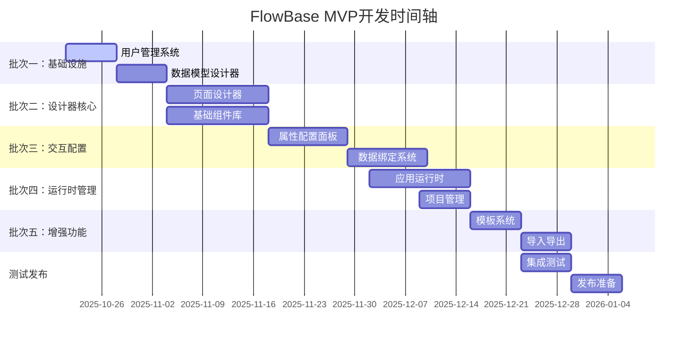

# FlowBase MVP版本开发路线图

**项目名称**: FlowBase - 全栈低代码开发平台
**版本**: MVP v1.0
**开发周期**: 2025年10月 - 2026年1月 (11周)
**文档版本**: v1.0
**创建日期**: 2025年10月21日

---

## 1. 项目时间轴总览

---

## 2. 详细阶段规划

### 阶段一：核心基础设施 (第1周：2025.10.21 - 2025.10.27)

#### 目标

基于现有认证系统，建立项目管理和数据建模能力

#### 说明

当前项目已具备完整的用户认证功能（注册、登录、密码重置等），本阶段专注于低代码平台特有功能

#### 主要交付物

- ✅ 项目管理系统（基于现有认证）
- ✅ 基础数据模型设计器
- ✅ 自动API生成功能

#### 详细时间安排

**第1周 (10.21-10.27)**

- **周一/周二**: 并行执行两个命令
  - 命令1：项目管理功能规范生成
  - 命令2：数据模型设计器规范生成
- **周三/周四**: 并行开发两个功能
  - 项目管理功能开发
  - 数据模型设计器开发
- **周五**: 功能集成测试和优化

#### 里程碑验收标准

- [ ] 用户可以创建、管理低代码项目
- [ ] 用户可以邀请协作者加入项目
- [ ] 用户可以创建基础数据表（包含4种字段类型）
- [ ] 自动生成的基础CRUD API可正常工作

#### 风险与缓解

- **风险**: 项目权限管理复杂度
- **缓解**: 基于现有Supabase RLS系统简化实现

---

### 阶段二：设计器核心功能 (第2-3周：2025.10.28 - 2025.11.10)

#### 目标

构建可视化页面设计的核心能力

#### 主要交付物

- ✅ 页面设计器基础功能
- ✅ 20个基础组件库
- ✅ 拖拽搭建能力

#### 详细时间安排

**第2周 (10.28-11.03)**

- **周一**: 执行命令3 - 页面设计器
- **周二/周三**: 页面设计器架构搭建
  - 三列布局实现
  - 基础拖拽系统
- **周四/周五**: 画布和基础布局功能

**第3周 (11.04-11.10)**

- **周一**: 执行命令4 - 基础组件库
- **周二/周三**: 组件库架构设计
- **周四/周五**: 20个基础组件开发
  - 表单组件 (6个)
  - 展示组件 (5个)
  - 布局组件 (5个)
  - 数据组件 (4个)

#### 里程碑验收标准

- [ ] 用户可以拖拽组件到画布
- [ ] 基础布局功能正常工作
- [ ] 20个基础组件可以正常使用
- [ ] 页面可以保存和加载

#### 风险与缓解

- **风险**: 拖拽性能问题
- **缓解**: 采用虚拟滚动，优化渲染性能

---

### 阶段三：交互与配置 (第4-5周：2025.11.11 - 2025.11.24)

#### 目标

完善组件配置和数据交互能力

#### 主要交付物

- ✅ 组件属性配置面板
- ✅ 基础数据绑定系统

#### 详细时间安排

**第4周 (11.11-11.17)**

- **周一**: 执行命令5 - 属性配置面板
- **周二/周三**: 属性面板开发
- **周四/周五**: 事件绑定和样式配置

**第5周 (11.18-11.24)**

- **周一**: 执行命令6 - 数据绑定系统
- **周二/周三**: 数据源管理
- **周四/周五**: 表单数据提交和验证

#### 里程碑验收标准

- [ ] 选中组件可以配置属性
- [ ] 组件可以绑定到数据源
- [ ] 表单数据可以正常提交
- [ ] 基础数据验证功能正常

#### 风险与缓解

- **风险**: 数据绑定复杂度高
- **缓解**: 先实现基础绑定，后续迭代优化

---

### 阶段四：应用运行时 (第6-7周：2025.11.25 - 2025.12.08)

#### 目标

实现应用运行时环境

#### 说明

项目管理功能已在阶段一完成，本阶段专注于运行时环境

#### 主要交付物

- ✅ 应用运行时环境

#### 详细时间安排

**第6周 (11.25-12.01)**

- **周一**: 执行命令7 - 应用运行时环境
- **周二/周四**: 运行时渲染引擎开发
- **周五**: 路由系统实现

**第7周 (12.02-12.08)**

- **周一/周三**: 运行时功能完善
- **周四/周五**: 性能优化和测试

#### 里程碑验收标准

- [ ] 设计的页面可以正常运行
- [ ] 数据可以正常展示和提交
- [ ] 页面间导航功能正常
- [ ] 响应式布局适配正常

#### 风险与缓解

- **风险**: 运行时渲染性能问题
- **缓解**: 优化渲染算法，使用懒加载

---

### 阶段五：增强功能 (第8-9周：2025.12.09 - 2025.12.22)

#### 目标

提供模板系统和数据管理功能

#### 主要交付物

- ✅ 基础应用模板系统
- ✅ 导入导出功能

#### 详细时间安排

**第8周 (12.09-12.15)**

- **周一**: 执行命令9 - 模板系统
- **周二/周三**: 预置模板开发
- **周四/周五**: 模板自定义功能

**第9周 (12.16-12.22)**

- **周一**: 执行命令9 - 导入导出功能
- **周二/周三**: 数据导出功能
- **周四/周五**: 数据导入和备份恢复

#### 里程碑验收标准

- [ ] 用户可以基于模板创建应用
- [ ] 应用配置可以导出和导入
- [ ] 数据备份和恢复功能正常

#### 风险与缓解

- **风险**: 模板系统设计复杂
- **缓解**: 从简单模板开始，逐步扩展

---

### 阶段六：测试与发布 (第10-11周：2025.12.23 - 2026.01.05)

#### 目标

全面测试和发布准备

#### 主要交付物

- ✅ 完整的集成测试
- ✅ 用户文档
- ✅ 发布版本

#### 详细时间安排

**第10周 (12.23-12.29)**

- **周一/周三**: 全功能集成测试
- **周四/周五**: 性能测试和优化
- **周末**: Bug修复

**第11周 (12.30-01.05)**

- **周一/周二**: 用户文档编写
- **周三/周四**: 部署配置
- **周五**: 正式发布

#### 里程碑验收标准

- [ ] 所有功能通过测试
- [ ] 性能指标达到要求
- [ ] 用户文档完整
- [ ] 生产环境部署成功

---

## 3. 团队协作计划

### 3.1 角色分工

| 角色       | 人数 | 主要职责                     | 关键技能                          |
| ---------- | ---- | ---------------------------- | --------------------------------- |
| 技术负责人 | 1    | 整体架构、技术决策、进度管理 | Next.js, Supabase, 低代码平台设计 |
| 前端开发   | 2    | 页面设计器、组件库、运行时   | React, TypeScript, 拖拽技术       |
| 后端开发   | 1    | 数据模型、API设计、权限系统  | Supabase, PostgreSQL, API设计     |
| UI/UX设计  | 1    | 界面设计、交互设计           | Figma, 用户体验设计               |
| 测试工程师 | 1    | 功能测试、性能测试           | 自动化测试, 性能测试              |

### 3.2 协作机制

#### 每日站会

- **时间**: 每天上午9:30
- **时长**: 15分钟
- **内容**: 昨日进展、今日计划、阻塞问题

#### 每周回顾

- **时间**: 每周五下午
- **时长**: 1小时
- **内容**: 进展回顾、风险识别、下周计划

#### 里程碑评审

- **时间**: 每个阶段结束后
- **时长**: 2小时
- **内容**: 功能演示、质量评估、下阶段规划

### 3.3 质量保证

#### 代码审查

- 所有代码必须经过Code Review
- 重点关注：性能、安全性、可维护性
- 使用PR模板标准化审查流程

#### 测试策略

- 单元测试覆盖率 > 60%
- 集成测试覆盖主要用户流程
- 性能测试确保响应时间要求

#### 文档要求

- API文档自动生成
- 用户使用手册
- 开发者文档

---

## 4. 风险管理

### 4.1 技术风险

| 风险             | 概率 | 影响 | 缓解措施                     |
| ---------------- | ---- | ---- | ---------------------------- |
| 拖拽性能问题     | 中   | 高   | 虚拟滚动、增量更新、性能监控 |
| Supabase集成复杂 | 中   | 中   | 预研技术方案、备选架构       |
| 浏览器兼容性     | 低   | 中   | 使用现代浏览器API、polyfill  |
| 数据一致性       | 中   | 高   | 事务处理、冲突检测机制       |

### 4.2 项目风险

| 风险     | 概率 | 影响 | 缓解措施             |
| -------- | ---- | ---- | -------------------- |
| 需求变更 | 高   | 中   | 敏捷开发、快速迭代   |
| 人员变动 | 低   | 高   | 知识文档化、代码规范 |
| 进度延期 | 中   | 高   | 里程碑监控、资源调配 |
| 质量问题 | 中   | 中   | 持续集成、自动化测试 |

### 4.3 应急预案

#### 进度延期应对

- 功能优先级调整
- 资源重新分配
- 并行开发任务

#### 技术问题应对

- 技术专家支持
- 外部技术咨询
- 备选技术方案

#### 质量问题应对

- 增加测试资源
- 延长测试时间
- 分阶段发布

---

## 5. 成功标准

### 5.1 功能完整性指标

- [ ] 用户可以完成完整的注册到创建应用流程
- [ ] 支持创建包含3-5个数据表的简单应用
- [ ] 支持搭建包含表单和列表的基础页面
- [ ] 所有MVP功能正常运行

### 5.2 性能指标

- [ ] 页面加载时间 < 3秒
- [ ] 拖拽响应时间 < 200ms
- [ ] 数据查询响应 < 800ms
- [ ] 系统稳定性 > 95%

### 5.3 用户体验指标

- [ ] 新用户15分钟内完成第一个页面搭建
- [ ] 界面响应流畅，无明显卡顿
- [ ] 错误提示清晰，操作反馈及时
- [ ] 用户满意度 > 80%

### 5.4 技术质量指标

- [ ] 代码测试覆盖率 > 60%
- [ ] 通过安全扫描
- [ ] 符合代码规范
- [ ] 文档完整性 > 90%

---

## 6. 后续规划

### 6.1 v1.1版本规划 (发布后3个月)

#### 功能增强

- 高级组件库扩展 (50+组件)
- 复杂数据绑定和表达式引擎
- 高级权限管理
- 第三方集成能力

#### 技术优化

- 性能优化和缓存机制
- 移动端适配优化
- 国际化支持
- 可访问性改进

### 6.2 长期规划 (6-12个月)

#### 平台化能力

- 插件系统
- 开发者工具
- API开放平台
- 应用市场

#### 企业级功能

- 多租户支持
- 高级工作流
- 数据分析
- 企业集成

---

## 7. 资源需求

### 7.1 人力资源

- **核心团队**: 6人
- **总人月**: 16.5人月
- **关键技能**: Next.js, React, Supabase, 低代码平台设计

### 7.2 技术资源

- **开发环境**: 现有技术栈
- **云服务**: Supabase Pro计划
- **工具软件**: Figma, GitHub, Claude Code
- **测试环境**: 独立测试环境

### 7.3 预算估算

- **人力成本**: 主要开销
- **云服务成本**: 较低（Supabase托管）
- **工具软件成本**: 较低（开源工具为主）
- **其他成本**: 文档、培训等

---

**文档结束**
