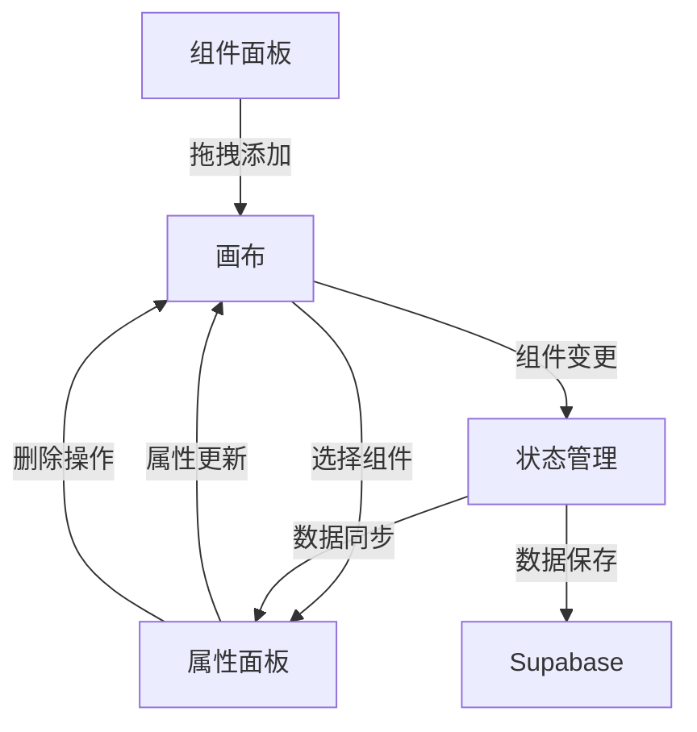

# 🎯 低代码设计器 MVP 版本核心功能设计文档

## 📋 项目概述

本文档基于 `/docs/legacy-designs` 目录下的三个核心设计文档（属性面板、组件面板、画布设计），结合当前项目现状，制定适合快速完成MVP版本开发的核心功能规划。

### 🎯 MVP版本目标

- 快速构建可用的低代码设计器基础框架
- 专注PC端用户体验，暂不考虑移动端适配
- 提供完整的拖拽式页面设计工作流
- 为后续功能扩展奠定坚实基础

### 🚫 暂不包含的功能

- 分享和导出功能
- 性能分析和监控
- 组件注册和管理系统
- 响应式布局和多设备预览
- 高级动画和交互效果
- 数据绑定和动态内容

---

## 🏗️ 技术架构设计

### 核心技术栈

```
Frontend: Next.js 15 + React 19 + TypeScript
UI库: shadcn/ui + Tailwind CSS
状态管理: React useState (MVP阶段简化)
拖拽功能: HTML5原生拖拽API
存储: Supabase (已配置)
```

### 数据结构设计

```typescript
// 组件基础数据结构
interface ComponentData {
  id: string // 唯一标识符
  type: ComponentType // 组件类型
  position: Position // 位置信息
  props: Record<string, any> // 组件属性
  styles: StyleConfig // 样式配置
  createdAt: Date // 创建时间
}

// 组件类型枚举
type ComponentType =
  | 'Text' // 文本组件
  | 'Button' // 按钮组件
  | 'Input' // 输入框组件
  | 'Image' // 图片组件
  | 'Card' // 卡片组件
  | 'Checkbox' // 复选框组件

// 位置信息
interface Position {
  x: number // X坐标
  y: number // Y坐标
  width?: number // 宽度
  height?: number // 高度
}

// 样式配置
interface StyleConfig {
  backgroundColor?: string
  color?: string
  fontSize?: string
  fontWeight?: string
  padding?: string
  margin?: string
  borderRadius?: string
}

// 页面设计数据
interface PageDesign {
  id: string
  name: string
  projectId: string
  components: ComponentData[]
  createdAt: Date
  updatedAt: Date
}
```

---

## 🧩 组件面板 (Component Panel) 设计

### 🎯 核心功能

1. **基础组件展示**：6个核心组件的网格布局
2. **拖拽功能**：HTML5原生拖拽实现组件添加
3. **组件分类**：按用途分组的简单分类
4. **视觉反馈**：拖拽时的视觉提示

### 📦 组件清单

#### 1. 基础组件 (Basic)

- **Text (文本)**
  - 功能：显示静态文本内容
  - 默认属性：`text: "文本内容"`
  - 样式：可配置字体大小、颜色、粗细

- **Button (按钮)**
  - 功能：触发点击操作
  - 默认属性：`text: "按钮", variant: "default"`
  - 样式：支持主要、次要、轮廓等变体

- **Input (输入框)**
  - 功能：用户文本输入
  - 默认属性：`placeholder: "请输入内容"`
  - 样式：支持边框、圆角、占位符样式

#### 2. 展示组件 (Display)

- **Image (图片)**
  - 功能：显示图片内容
  - 默认属性：`src: "", alt: "图片描述"`
  - 样式：可配置尺寸、圆角、边框

- **Card (卡片)**
  - 功能：内容容器和分组
  - 默认属性：`title: "卡片标题", content: "卡片内容"`
  - 样式：阴影、边框、内边距

#### 3. 交互组件 (Interactive)

- **Checkbox (复选框)**
  - 功能：多选交互
  - 默认属性：`label: "选项", checked: false`
  - 样式：复选框大小、标签样式

### 🎨 界面设计

```typescript
// 组件面板布局结构
interface ComponentPanelProps {
  onAddComponent: (componentType: ComponentType) => void
}

// 组件卡片定义
interface ComponentCard {
  type: ComponentType
  name: string
  description: string
  icon: LucideIcon
  category: string
}
```

**布局要求：**

- 固定宽度：256px (w-64)
- 顶部标题区域
- 中间组件网格区域（2列布局）
- 简洁的视觉设计，突出组件本身

---

## 🖼️ 画布 (Canvas) 设计

### 🎯 核心功能

1. **组件拖放**：接收组件面板拖拽的组件
2. **组件选择**：点击选择组件，显示选中状态
3. **组件移动**：拖拽移动已放置的组件
4. **智能定位**：避免组件重叠的智能布局
5. **组件删除**：支持组件删除操作
6. **实时渲染**：组件的实时渲染和显示

### 🎨 界面设计

```typescript
// 画布组件接口
interface CanvasProps {
  components: ComponentData[]
  selectedComponent: ComponentData | null
  onSelectComponent: (component: ComponentData | null) => void
  onUpdateComponent: (componentId: string, updates: Partial<ComponentData>) => void
}
```

**布局要求：**

- 弹性布局，占据中间主要区域
- 灰色背景，模拟设计器画布
- 支持滚动，适应大量组件
- 组件的绝对定位布局

### 🔧 智能定位算法

```typescript
// 智能定位：避免组件重叠
const findNextPosition = (components: ComponentData[]): Position => {
  const baseX = 50
  const baseY = 120
  const stepX = 180
  const stepY = 80
  const itemsPerRow = 6

  // 网格化布局，自动查找空位
  // 实现细节...
}
```

### 🎯 交互逻辑

1. **拖拽接收**：监听 `onDragOver` 和 `onDrop` 事件
2. **组件选择**：点击组件触发选择事件
3. **组件移动**：选中状态下支持拖拽移动
4. **删除操作**：选中后按Delete键或右键菜单
5. **视觉反馈**：选中状态、拖拽状态的视觉提示

---

## ⚙️ 属性面板 (Property Panel) 设计

### 🎯 核心功能

1. **属性编辑**：编辑选中组件的基础属性
2. **样式配置**：配置组件的基础样式
3. **实时预览**：修改后即时更新画布显示
4. **组件删除**：提供删除组件的操作按钮
5. **空状态处理**：未选中组件时的提示界面

### 🎨 界面设计

```typescript
// 属性面板接口
interface PropertyPanelProps {
  selectedComponent: ComponentData | null
  onUpdateComponent: (componentId: string, updates: Partial<ComponentData>) => void
  onDeleteComponent: (componentId: string) => void
}
```

**布局要求：**

- 固定宽度：320px (w-80)
- 顶部选中组件信息
- 中间属性编辑区域
- 底部操作按钮区域

### 📝 属性配置项

#### 通用属性 (所有组件)

```typescript
interface CommonProps {
  // 基础属性
  id: string // 只读
  type: string // 只读

  // 样式属性
  backgroundColor: ColorPicker
  color: ColorPicker
  fontSize: Select
  fontWeight: Select
  padding: NumberInput
  margin: NumberInput
  borderRadius: NumberInput
}
```

#### 特定组件属性

**Text 组件**

- `text`: TextArea (文本内容)
- `textAlign`: Select (对齐方式)

**Button 组件**

- `text`: TextInput (按钮文字)
- `variant`: Select (按钮变体: default/outline/secondary)

**Input 组件**

- `placeholder`: TextInput (占位符)
- `type`: Select (输入类型: text/password/email)

**Image 组件**

- `src`: TextInput (图片地址)
- `alt`: TextInput (替代文本)
- `width`: NumberInput (宽度)
- `height`: NumberInput (高度)

**Card 组件**

- `title`: TextInput (卡片标题)
- `content`: TextArea (卡片内容)

**Checkbox 组件**

- `label`: TextInput (选项标签)
- `checked`: Toggle (选中状态)

---

## 🔄 数据流设计

### 整体数据流向



### 状态管理策略

MVP阶段使用简化的状态管理：

```typescript
// 页面设计器主状态
interface DesignerState {
  components: ComponentData[] // 所有组件
  selectedComponent: ComponentData | null // 选中组件
  saving: boolean // 保存状态
}

// 状态提升到顶层组件
// 通过props向下传递状态和更新函数
```

### 核心操作流程

1. **添加组件**：组件面板 → 画布 → 状态更新
2. **选择组件**：画布点击 → 属性面板更新
3. **编辑属性**：属性面板 → 状态更新 → 画布重渲染
4. **删除组件**：属性面板 → 状态更新 → 画布重渲染
5. **保存设计**：状态序列化 → Supabase存储

---

## 🎨 PC端交互设计

### 鼠标交互

- **左键点击**：选择组件、激活控件
- **拖拽操作**：添加组件、移动组件位置
- **悬停效果**：显示操作提示、高亮可交互元素
- **右键菜单**：组件上下文操作（MVP可选）

### 键盘快捷键

- **Delete**：删除选中组件
- **Ctrl+Z**：撤销操作（MVP可选）
- **Ctrl+S**：保存设计

### 视觉反馈

- **选中状态**：蓝色边框高亮
- **拖拽状态**：半透明效果
- **悬停状态**：轻微阴影效果
- **禁用状态**：灰色显示

---

## 📈 开发优先级和里程碑

### Phase 1: 核心基础 (1-2周)

**目标：建立基础框架和核心流程**

#### 组件面板

- [x] 基础布局结构
- [ ] 6个核心组件卡片
- [ ] 拖拽功能实现
- [ ] 组件图标和描述

#### 画布

- [ ] 拖拽接收功能
- [ ] 组件渲染系统
- [ ] 选择和移动功能
- [ ] 智能定位算法

#### 属性面板

- [ ] 基础布局结构
- [ ] 通用属性编辑器
- [ ] 特定组件属性
- [ ] 实时更新功能

### Phase 2: 体验优化 (1周)

**目标：完善用户体验和细节**

#### 功能完善

- [ ] 组件删除功能
- [ ] 保存和加载功能
- [ ] 空状态处理
- [ ] 错误处理

#### 体验优化

- [ ] 加载状态提示
- [ ] 操作反馈优化
- [ ] 视觉细节完善
- [ ] 交互流畅性优化

### Phase 3: 集成测试 (0.5周)

**目标：确保质量和稳定性**

#### 测试验证

- [ ] 功能完整性测试
- [ ] 边界情况测试
- [ ] 性能初步验证
- [ ] 用户体验测试

---

## 🎯 MVP版本成功标准

### 功能完整性

- ✅ 支持拖拽添加6种核心组件
- ✅ 支持组件选择和移动
- ✅ 支持基础属性和样式配置
- ✅ 支持组件删除操作
- ✅ 支持设计保存和加载

### 用户体验

- ✅ 三栏布局稳定可用
- ✅ 拖拽操作流畅自然
- ✅ 属性配置实时生效
- ✅ 视觉反馈清晰明确
- ✅ 错误提示友好易懂

### 技术质量

- ✅ 代码结构清晰合理
- ✅ 组件复用性良好
- ✅ 性能满足基本要求
- ✅ TypeScript类型完整
- ✅ 响应式布局基础支持

---

## 🚀 后续扩展规划

### 下一版本功能 (Post-MVP)

1. **组件扩展**：更多组件类型支持
2. **高级样式**：边框、阴影、渐变等
3. **响应式设计**：多断点布局支持
4. **交互功能**：点击事件、表单验证
5. **预览模式**：真实页面预览功能

### 长期规划

1. **协作功能**：多人协作编辑
2. **版本控制**：设计历史管理
3. **模板系统**：预设模板库
4. **插件系统**：第三方组件支持
5. **数据绑定**：动态内容管理

---

## 📝 总结

本MVP版本设计文档聚焦于核心功能的快速实现，通过合理的功能取舍和技术简化，确保在有限时间内完成可用的低代码设计器基础版本。

**关键成功因素：**

1. **功能聚焦**：专注最核心的拖拽式设计体验
2. **技术简化**：使用成熟稳定的技术方案
3. **用户体验**：确保核心交互流程的流畅性
4. **扩展性**：为后续功能扩展预留良好架构

这个设计方案将为快速完成MVP版本开发提供清晰的指导，同时为产品的长期发展奠定坚实基础。
