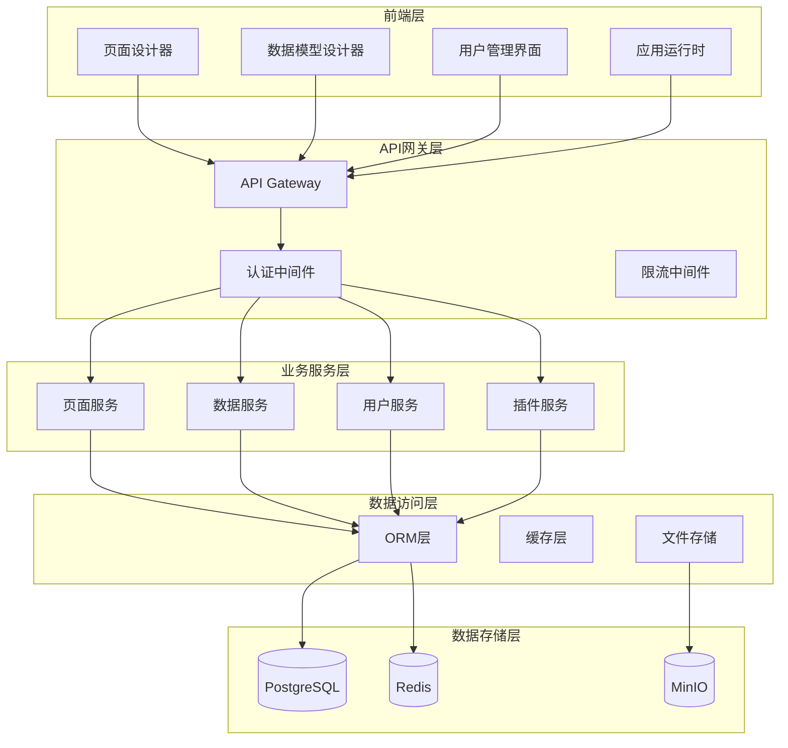

# FlowBase - 全栈低代码平台需求文档

## 文档信息

- **项目名称**: FlowBase - 全栈低代码开发平台
- **文档版本**: v1.0
- **创建日期**: 2025年10月20日
- **文档类型**: 产品需求文档(PRD)

---

## 1. 项目概述

### 1.1 项目背景

基于对国内低代码市场的深入调研，我们发现：

1. **市场需求旺盛**: 企业数字化转型加速，对快速应用开发的需求激增
2. **现有方案不足**: 大多数平台要么过于复杂（需要专业开发），要么功能受限（无法满足复杂业务需求）
3. **技术趋于成熟**: 阿里低代码引擎协议成为事实标准，开源生态丰富
4. **用户群体明确**: 中小企业IT团队、企业内部开发者、业务部门技术人员

### 1.2 项目定位

**FlowBase** 是一个面向开发者的全栈低代码平台，定位为：

- **技术定位**: 开源的企业级全栈低代码开发平台
- **用户定位**: 有一定技术基础的开发者团队、企业IT部门
- **价值定位**: 提供从数据库到前端UI的一站式低代码开发能力

### 1.3 核心价值主张

1. **全栈能力**: 从数据模型设计到前端页面搭建，完整的开发链路
2. **开源可控**: 基于成熟开源技术栈，支持私有化部署
3. **开发者友好**: 降低开发门槛，但不牺牲灵活性
4. **企业级特性**: 权限管理、多租户、API集成等企业功能

---

## 2. 目标用户分析

### 2.1 主要用户群体

| 用户群体                 | 特征                     | 需求痛点                 | 使用场景               |
| ------------------------ | ------------------------ | ------------------------ | ---------------------- |
| **中小企业IT团队**       | 3-10人技术团队，资源有限 | 开发效率低，重复工作多   | 内部管理系统、业务工具 |
| **企业业务部门技术人员** | 有一定编程基础，懂业务   | 传统开发太慢，业务需求急 | 部门级应用、数据工具   |
| **独立开发者/初创公司**  | 技术能力强，追求效率     | 快速验证MVP，控制成本    | SaaS产品、原型开发     |
| **传统软件公司**         | 寻找技术升级方案         | 项目交付慢，人力成本高   | 项目快速交付、客户定制 |

### 2.2 用户画像

**主要用户画像 - 张工**

- 角色: 中型软件公司技术负责人
- 背景: 8年开发经验，全栈能力
- 团队规模: 15人技术团队
- 痛点:
  - 客户需求变化快，传统开发响应慢
  - 重复的CRUD开发占用大量人力
  - 新人培训周期长，项目质量不稳定
- 期望:
  - 提高团队整体开发效率
  - 降低项目交付风险
  - 让初级开发者也能承担复杂任务

---

## 3. 产品功能规划

### 3.1 核心功能模块

#### 3.1.1 数据模型设计器

**功能描述**: 可视化数据表设计，支持字段定义、关系配置、索引设置

**核心特性**:

- 拖拽式字段添加
- 支持字段类型：文本、数字、日期、文件、图片、JSON等
- 一对一、一对多、多对多关系配置
- 数据验证规则设置
- 自动生成RESTful API

**技术实现**:

```javascript
// 数据模型Schema示例
{
  "name": "User",
  "fields": [
    {
      "name": "id",
      "type": "string",
      "primaryKey": true,
      "required": true
    },
    {
      "name": "name",
      "type": "string",
      "required": true,
      "validation": {
        "minLength": 2,
        "maxLength": 50
      }
    },
    {
      "name": "avatar",
      "type": "file",
      "validation": {
        "mimeType": ["image/jpeg", "image/png"],
        "maxSize": "2MB"
      }
    }
  ],
  "relations": [
    {
      "type": "hasMany",
      "target": "Order",
      "foreignKey": "userId"
    }
  ]
}
```

#### 3.1.2 可视化页面设计器

**功能描述**: 基于拖拽的页面搭建，支持组件布局、属性配置、数据绑定

**核心特性**:

- 丰富的组件库（50+基础组件）
- 自由布局 + 流式布局支持
- 实时预览
- 响应式设计
- 组件嵌套和复用

**技术架构**:

```
页面设计器
├── 画布引擎 (Canvas Engine)
│   ├── 拖拽系统 (基于Pointer Events)
│   ├── 布局算法 (Flexbox + Grid)
│   └── 辅助功能 (参考线、吸附)
├── 组件库 (Component Library)
│   ├── 基础组件 (Button, Input, Table...)
│   ├── 业务组件 (用户选择器、部门树...)
│   └── 布局组件 (Container, Row, Col...)
├── 属性配置面板 (Property Panel)
│   ├── 基础属性设置
│   ├── 样式配置
│   ├── 事件绑定
│   └── 数据源绑定
└── Schema管理 (Schema Manager)
    ├── 页面结构存储
    ├── 版本管理
    └── 导入导出
```

#### 3.1.3 数据流与逻辑编排

**功能描述**: 可视化业务逻辑配置，支持数据绑定、事件处理、工作流

**核心特性**:

- 表达式编辑器 (支持JavaScript表达式)
- 事件动作链
- 数据源集成
- 条件逻辑
- API调用配置

**实现示例**:

```typescript
// 页面级数据流配置
{
  "dataSources": [
    {
      "id": "userList",
      "type": "api",
      "config": {
        "url": "/api/users",
        "method": "GET",
        "autoLoad": true
      }
    }
  ],
  "events": [
    {
      "trigger": "button.onClick",
      "actions": [
        {
          "type": "setState",
          "payload": { "loading": true }
        },
        {
          "type": "callApi",
          "dataSource": "createUser",
          "params": { "name": "{{state.formData.name}}" }
        },
        {
          "type": "setState",
          "payload": { "loading": false }
        },
        {
          "type": "showMessage",
          "config": { "type": "success", "content": "创建成功" }
        }
      ]
    }
  ]
}
```

#### 3.1.4 权限管理系统

**功能描述**: 企业级权限控制，支持角色管理、数据权限、操作权限

**核心特性**:

- 基于RBAC的权限模型
- 数据级权限控制
- 前端组件级权限
- API接口权限验证
- 单点登录支持

### 3.2 高级功能

#### 3.2.1 插件系统

**目标**: 提供平台扩展能力，支持自定义组件和功能

**技术方案**:

```typescript
// 插件接口定义
interface Plugin {
  name: string
  version: string
  components?: ComponentDefinition[]
  apis?: ApiDefinition[]
  hooks?: HookDefinition[]
}

// 插件注册
class PluginManager {
  register(plugin: Plugin): void
  unregister(pluginName: string): void
  getPlugin(name: string): Plugin | null
}
```

#### 3.2.2 代码生成与导出

**功能**: 将低代码配置生成高质量源代码，支持脱离平台运行

**支持技术栈**:

- 前端: React + TypeScript + Ant Design
- 后端: Node.js + Express + TypeScript
- 数据库: PostgreSQL / MySQL / SQLite

#### 3.2.3 API集成能力

**功能**: 支持与外部系统集成

**支持方式**:

- RESTful API调用
- GraphQL查询
- Webhook接收
- 数据库直连
- 文件导入导出

---

## 4. 技术架构设计

### 4.1 整体架构



### 4.2 技术栈选择

| 层级         | 技术选择              | 选择理由                     |
| ------------ | --------------------- | ---------------------------- |
| **前端框架** | React 18 + TypeScript | 生态成熟、类型安全、社区活跃 |
| **UI组件库** | Ant Design + Formily  | 企业级UI、表单能力强         |
| **状态管理** | Zustand               | 轻量级、TypeScript友好       |
| **构建工具** | Vite                  | 开发体验好、构建速度快       |
| **后端框架** | Node.js + Express     | JavaScript全栈、开发效率高   |
| **ORM框架**  | Sequelize             | 功能完善、支持多数据库       |
| **数据库**   | PostgreSQL            | 功能强大、开源               |
| **缓存**     | Redis                 | 性能优秀、功能丰富           |
| **文件存储** | MinIO                 | S3兼容、开源                 |

### 4.3 核心技术难点与解决方案

#### 4.3.1 拖拽性能优化

**问题**: 复杂页面拖拽卡顿
**解决方案**:

- 使用虚拟滚动技术，只渲染可见区域
- 实现增量更新，避免全量重渲染
- 使用防抖节流优化高频事件
- Web Worker处理复杂计算

#### 4.3.2 Schema设计

**问题**: 平衡简洁性和完备性
**解决方案**:

- 参考阿里低代码引擎协议（事实标准）
- 分层设计：基础协议 + 扩展协议
- 向后兼容的版本管理
- 完整的TypeScript类型定义

#### 4.3.3 表达式安全

**问题**: 防止XSS攻击和代码注入
**解决方案**:

- 沙箱环境执行用户代码
- 白名单机制限制可访问对象
- AST静态分析检测危险操作
- CSP(Content Security Policy)配置

---

## 5. 用户体验设计

### 5.1 设计原则

1. **渐进式学习**: 新手可以快速上手，专家可以深度定制
2. **所见即所得**: 所有修改都能实时预览
3. **一致性**: 统一的交互模式和视觉风格
4. **响应式**: 适配不同屏幕尺寸和设备
5. **可访问性**: 支持键盘导航和屏幕阅读器

### 5.2 界面布局

```
┌─────────────────────────────────────────────────────────┐
│ 顶部导航栏 (Top Navigation)                               │
├─────────────────────────────────────────────────────────┤
│ 左侧 │              主要工作区域                         │
│ 菜单 │  ┌─────────────────────────────────────────────┐   │
│      │  │            画布区域                        │   │
│ 项目 │  │                                             │   │
│ 组件 │  │                                             │   │
│ 数据 │  │                                             │   │
│ 逻辑 │  │                                             │   │
│ 设置 │  └─────────────────────────────────────────────┘   │
│      │  ┌─────────────────────────────────────────────┐   │
│      │  │            属性面板                        │   │
│      │  │                                             │   │
│      │  └─────────────────────────────────────────────┘   │
└─────────────────────────────────────────────────────────┘
```

### 5.3 关键交互设计

#### 5.3.1 拖拽交互

- **组件拖入**: 从组件库拖拽到画布，显示插入位置预览
- **组件移动**: 画布内组件移动，显示参考线和对齐提示
- **组件调整**: 支持调整大小、旋转等操作
- **批量操作**: 支持多选、批量删除、批量复制

#### 5.3.2 快捷键支持

| 快捷键 | 功能         | 说明 |
| ------ | ------------ | ---- |
| Ctrl+C | 复制选中组件 |      |
| Ctrl+V | 粘贴组件     |      |
| Ctrl+Z | 撤销操作     |      |
| Ctrl+Y | 重做操作     |      |
| Delete | 删除选中组件 |      |
| Ctrl+S | 保存页面     |      |
| Ctrl+P | 预览页面     |      |

---

## 6. 技术实现方案

### 6.1 开发阶段规划

#### 第一阶段 - MVP版本 (3个月)

**目标**: 核心功能可用，支持基本应用搭建

**功能范围**:

- 基础数据模型设计
- 简单页面搭建
- 基础组件库 (20个组件)
- 用户认证和基础权限
- 简单数据绑定

**技术实现**:

```typescript
// MVP版本核心功能结构
src/
├── components/           # 组件库
│   ├── basic/           # 基础组件
│   └── business/        # 业务组件
├── designer/            # 设计器
│   ├── canvas/          # 画布
│   ├── panel/           # 属性面板
│   └── components/      # 组件列表
├── runtime/             # 运行时
├── services/            # 服务层
├── stores/              # 状态管理
└── utils/               # 工具函数
```

#### 第二阶段 - 完整功能 (3个月)

**目标**: 企业级功能完善，支持复杂应用开发

**新增功能**:

- 完整权限管理系统
- 工作流引擎
- API集成功能
- 插件系统基础
- 代码生成功能
- 移动端适配

#### 第三阶段 - 生态建设 (6个月)

**目标**: 构建开发者生态，提供企业级解决方案

**重点功能**:

- 完善插件生态
- 模板市场
- 开发者工具
- 性能优化
- 多语言支持

### 6.2 技术实现细节

#### 6.2.1 组件元信息定义

```typescript
interface ComponentMeta {
  // 基础信息
  componentName: string
  title: string
  description?: string
  icon?: string
  category: string

  // 组件能力
  isContainer?: boolean
  nestingRule?: {
    childWhitelist?: string[]
    parentWhitelist?: string[]
  }

  // 属性配置
  props: PropMeta[]

  // 编辑器配置
  configure: {
    supports: {
      style: boolean
      events: boolean
      loop: boolean
      condition: boolean
    }
  }

  // 初始化模板
  snippets?: ComponentSnippet[]
}

// 示例：按钮组件配置
const ButtonMeta: ComponentMeta = {
  componentName: 'Button',
  title: '按钮',
  category: '基础组件',
  props: [
    {
      name: 'type',
      title: '按钮类型',
      type: 'string',
      setter: 'SelectSetter',
      defaultValue: 'default',
      options: [
        { label: '主按钮', value: 'primary' },
        { label: '次按钮', value: 'default' },
        { label: '虚线按钮', value: 'dashed' },
      ],
    },
    {
      name: 'onClick',
      title: '点击事件',
      type: 'function',
      setter: 'EventSetter',
    },
  ],
}
```

#### 6.2.2 Schema渲染引擎

```typescript
// React渲染器实现
class SchemaRenderer {
  render(schema: ComponentNode): React.ReactElement {
    const Component = this.getComponent(schema.componentName);

    if (!Component) {
      console.warn(`Component ${schema.componentName} not found`);
      return null;
    }

    // 处理条件渲染
    if (schema.condition === false) {
      return null;
    }

    // 处理循环渲染
    if (schema.loop && Array.isArray(schema.loop)) {
      return schema.loop.map((item, index) =>
        this.render({
          ...schema,
          loop: undefined,
          props: {
            ...schema.props,
            key: index,
            data: item
          }
        })
      );
    }

    // 渲染子组件
    const children = schema.children
      ? schema.children.map(child => this.render(child))
      : schema.props?.children;

    return (
      <Component key={schema.id} {...schema.props}>
        {children}
      </Component>
    );
  }

  private getComponent(name: string): React.ComponentType | null {
    // 从组件注册表获取组件
    return componentRegistry.get(name);
  }
}
```

#### 6.2.3 数据绑定系统

```typescript
// 表达式引擎
class ExpressionEngine {
  private sandbox: any

  constructor(context: any) {
    this.sandbox = this.createSandbox(context)
  }

  evaluate(expression: string): any {
    try {
      // 使用Function构造函数替代eval
      const fn = new Function(
        'context',
        `
        with(context) {
          return ${expression};
        }
      `
      )
      return fn(this.sandbox)
    } catch (error) {
      console.error('Expression evaluation error:', error)
      return undefined
    }
  }

  private createSandbox(context: any): any {
    // 创建安全的沙箱环境
    return {
      ...context.state,
      ...context.dataSource,
      ...context.utils,
      // 禁止访问危险对象
      window: undefined,
      document: undefined,
      eval: undefined,
      Function: undefined,
    }
  }
}

// 数据绑定解析器
function parseDataBinding(value: any): any {
  if (typeof value === 'object' && value.type === 'JSExpression') {
    return {
      type: 'binding',
      expression: value.value,
    }
  }
  return {
    type: 'static',
    value,
  }
}
```

### 6.3 性能优化策略

#### 6.3.1 编辑器优化

1. **虚拟滚动**: 大量组件时只渲染可视区域
2. **组件懒加载**: 按需加载组件代码
3. **防抖节流**: 优化拖拽和输入操作
4. **增量更新**: 只更新变化的DOM节点

```typescript
// 虚拟滚动实现
const VirtualCanvas = ({ components, itemHeight = 40 }) => {
  const [scrollTop, setScrollTop] = useState(0);
  const containerHeight = useWindowHeight();

  const startIndex = Math.floor(scrollTop / itemHeight);
  const endIndex = Math.min(
    startIndex + Math.ceil(containerHeight / itemHeight) + 1,
    components.length
  );

  const visibleComponents = components.slice(startIndex, endIndex);

  return (
    <div
      style={{ height: components.length * itemHeight, overflow: 'auto' }}
      onScroll={(e) => setScrollTop(e.target.scrollTop)}
    >
      <div style={{ height: startIndex * itemHeight }} />
      {visibleComponents.map((component, index) => (
        <ComponentItem
          key={component.id}
          component={component}
          style={{
            position: 'absolute',
            top: (startIndex + index) * itemHeight,
            height: itemHeight
          }}
        />
      ))}
    </div>
  );
};
```

#### 6.3.2 运行时优化

1. **代码分割**: 按页面分割代码
2. **组件缓存**: 缓存组件实例
3. **数据预取**: 预加载可能需要的数据
4. **图片懒加载**: 延迟加载图片资源

---

## 7. 非功能性需求

### 7.1 性能要求

| 指标             | 要求    | 测试条件                      |
| ---------------- | ------- | ----------------------------- |
| **页面加载时间** | < 3秒   | 首次访问，包含100个组件的页面 |
| **拖拽响应时间** | < 100ms | 复杂页面拖拽操作              |
| **数据查询响应** | < 500ms | 1000条数据查询                |
| **并发用户数**   | 1000+   | 同时在线编辑用户              |
| **系统可用性**   | 99.9%   | 7x24小时服务                  |

### 7.2 安全要求

1. **身份认证**: JWT令牌认证，支持单点登录
2. **权限控制**: 基于RBAC的细粒度权限管理
3. **数据安全**: 敏感数据加密存储，传输过程HTTPS加密
4. **输入验证**: 严格的输入验证和SQL注入防护
5. **安全审计**: 完整的操作日志和审计跟踪

### 7.3 兼容性要求

| 浏览器  | 最低版本 |
| ------- | -------- |
| Chrome  | 88+      |
| Firefox | 85+      |
| Safari  | 14+      |
| Edge    | 88+      |

### 7.4 可扩展性要求

1. **水平扩展**: 支持多实例部署，负载均衡
2. **插件机制**: 支持第三方插件开发
3. **API开放**: 提供完整的RESTful API
4. **多数据库**: 支持PostgreSQL、MySQL、SQLite

---

## 8. 项目规划

### 8.1 里程碑计划

| 阶段         | 时间 | 主要交付物             | 成功标准             |
| ------------ | ---- | ---------------------- | -------------------- |
| **设计阶段** | 2周  | 技术设计文档、原型设计 | 技术方案评审通过     |
| **MVP开发**  | 12周 | MVP版本、基础文档      | 支持基础CRUD应用搭建 |
| **功能完善** | 12周 | Beta版本、完整文档     | 支持复杂业务应用开发 |
| **产品发布** | 4周  | 正式版本、部署文档     | 产品正式发布上线     |
| **生态建设** | 24周 | 插件市场、开发者社区   | 形成初步开发者生态   |

### 8.2 团队配置建议

| 角色             | 人数 | 主要职责               |
| ---------------- | ---- | ---------------------- |
| **产品经理**     | 1    | 需求管理、产品规划     |
| **架构师**       | 1    | 技术架构设计、技术选型 |
| **前端开发**     | 3    | 页面设计器、运行时开发 |
| **后端开发**     | 2    | API开发、数据库设计    |
| **UI/UX设计**    | 1    | 界面设计、交互设计     |
| **测试工程师**   | 1    | 功能测试、性能测试     |
| **DevOps工程师** | 1    | 部署、运维、监控       |

### 8.3 风险评估与应对

| 风险等级 | 风险描述             | 影响程度   | 应对策略               |
| -------- | -------------------- | ---------- | ---------------------- |
| **高**   | 技术实现复杂度超预期 | 项目延期   | 分阶段实施，MVP先行    |
| **中**   | 性能无法满足要求     | 用户体验差 | 提前进行性能测试和优化 |
| **中**   | 用户接受度不高       | 产品失败   | 持续用户调研，快速迭代 |
| **低**   | 竞品抢先上市         | 市场压力   | 专注差异化优势         |

---

## 9. 商业模式

### 9.1 开源策略

**核心原则**: 核心功能开源，高级功能商业化

- **开源版本**: 完整的基础功能，满足中小企业需求
- **企业版本**: 高级安全功能、多租户、技术支持
- **云服务版本**: 托管式服务，按使用量付费

### 9.2 盈利模式

1. **企业订阅**: 企业版订阅服务
2. **技术支持**: 技术咨询和定制开发
3. **培训认证**: 开发者培训和认证服务
4. **插件市场**: 插件交易抽成

### 9.3 市场推广策略

1. **开源社区**: GitHub开源，技术社区推广
2. **内容营销**: 技术博客、案例分享、最佳实践
3. **开发者关系**: 举办技术沙龙、开发者大会
4. **合作伙伴**: 与系统集成商、咨询公司合作

---

## 10. 成功指标

### 10.1 产品指标

- **用户增长**: GitHub Stars > 5000，月活用户 > 10000
- **使用情况**: 创建应用数 > 10000，平均使用时长 > 30分钟/天
- **开发者生态**: 第三方插件 > 100，社区贡献者 > 50

### 10.2 技术指标

- **性能**: 页面加载时间 < 3秒，编辑器响应时间 < 100ms
- **稳定性**: 系统可用性 > 99.9%，Bug率 < 1%
- **代码质量**: 测试覆盖率 > 80%，代码审查通过率 100%

### 10.3 商业指标

- **收入**: 第一年实现收入 > 500万
- **客户**: 企业客户 > 100家，续费率 > 80%
- **市场份额**: 在开源低代码平台中进入前三

---

## 11. 附录

### 11.1 技术参考

1. **阿里低代码引擎**: https://github.com/alibaba/lowcode-engine
2. **百度amis**: https://github.com/baidu/amis
3. **NocoBase**: https://github.com/nocobase/nocobase
4. **Formily**: https://github.com/alibaba/formily

### 11.2 设计规范参考

1. **Ant Design设计规范**: https://ant.design/docs/spec/introduce-cn
2. **Material Design**: https://material.io/design
3. **人机交互指南**: Nielsen Norman Group

### 11.3 相关标准

1. **Web Content Accessibility Guidelines (WCAG) 2.1**
2. **RESTful API设计规范**
3. **GraphQL规范**

---

## 文档版本历史

| 版本 | 日期       | 修改人   | 主要变更     |
| ---- | ---------- | -------- | ------------ |
| v1.0 | 2025-10-20 | 产品团队 | 初始版本创建 |
|      |            |          |              |

---

**文档结束**
