# Data Model: Data Model Designer

**Date**: 2025-01-23
**Status**: Phase 1 Design
**Branch**: `002-data-model-designer`

## Entity Relationship Diagram

```mermaid
erDiagram
    Project ||--o{ DataTable : contains
    DataTable ||--o{ DataField : has
    DataTable ||--o{ TableRelationship : source
    DataTable ||--o{ TableRelationship : target
    DataTable ||--o{ SchemaVersion : versioned
    Project ||--o{ SchemaVersion : tracks
    DataTable ||--o{ TableLock : locked
    User ||--o{ TableLock : holds

    Project {
        string id PK
        string name
        string description
        string owner_id FK
        timestamp created_at
        timestamp updated_at
        boolean is_active
    }

    DataTable {
        string id PK
        string project_id FK
        string name
        string description
        string table_name
        json schema_definition
        string status
        string created_by FK
        timestamp created_at
        timestamp updated_at
    }

    DataField {
        string id PK
        string table_id FK
        string name
        string field_name
        string data_type
        boolean is_required
        string default_value
        json field_config
        integer sort_order
        timestamp created_at
        timestamp updated_at
    }

    TableRelationship {
        string id PK
        string project_id FK
        string source_table_id FK
        string target_table_id FK
        string source_field_id FK
        string target_field_id FK
        string relationship_name
        string relationship_type
        json cascade_config
        string status
        string created_by FK
        timestamp created_at
        timestamp updated_at
    }

    SchemaVersion {
        string id PK
        string project_id FK
        integer version_number
        string schema_hash
        json schema_snapshot
        array changes
        string parent_version_id
        boolean is_merged
        string created_by FK
        timestamp created_at
    }

    TableLock {
        string id PK
        string table_id FK
        string user_id FK
        string lock_token
        string lock_type
        timestamp locked_at
        timestamp expires_at
        string reason
    }

```



## Entity Definitions

### DataTable

Represents a user-defined database table with metadata and configuration.

**Purpose**: Core entity for storing table definitions created through the visual designer.

**Key Fields**:

- `table_name`: Database-friendly name (snake_case)
- `schema_definition`: JSON structure of table schema
- `status`: Draft, Active, Deprecated, Deleted

**Validation Rules**:

- `name` must be unique within project
- `table_name` must follow PostgreSQL naming conventions
- `schema_definition` must be valid JSON
- Required fields: `project_id`, `name`, `table_name`

### DataField

Represents individual columns within a DataTable with type and constraint information.

**Purpose**: Defines field properties including data types, validation rules, and default values.

**Supported Data Types**:

- `text`: VARCHAR/TEXT with length limits
- `number`: INTEGER, DECIMAL with precision/scale
- `date`: DATE, TIMESTAMP, TIME
- `boolean`: BOOLEAN with default values

**Key Fields**:

- `field_name`: Database column name (snake_case)
- `data_type`: One of the four supported types
- `is_required`: NOT NULL constraint
- `default_value`: Database default value

**Validation Rules**:

- `name` and `field_name` must be unique within table
- `data_type` must be one of supported types
- `sort_order` must be positive integer
- Required fields: `table_id`, `name`, `field_name`, `data_type`

### TableRelationship

Represents one-to-many relationships between DataTable instances.

**Purpose**: Enables foreign key constraints and relational data modeling.

**Relationship Types**:

- `one_to_many`: Standard foreign key relationship
- `many_to_many`: Through junction table (future enhancement)

**Key Fields**:

- `source_table_id`: "one" side of relationship
- `target_table_id`: "many" side of relationship
- `cascade_config`: JSON configuration for cascade behavior

**Validation Rules**:

- Cannot create circular dependencies
- Source and target tables must be in same project
- Cascade configuration must be valid JSON
- Required fields: `project_id`, `source_table_id`, `target_table_id`, `relationship_type`

### SchemaVersion

Tracks basic change history for schema modifications (MVP).

**Purpose**: Simple audit trail for schema changes without complex versioning.

**Key Fields**:

- `version_number`: Sequential integer within project
- `schema_snapshot`: Complete schema state at version
- `changes`: Array of change operations

**Validation Rules**:

- `version_number` must be unique within project
- `schema_snapshot` must be valid JSON
- Required fields: `project_id`, `version_number`, `schema_snapshot`

### TableLock

Manages concurrent access to prevent conflicting modifications.

**Purpose**: Implements locking mechanism for collaborative editing.

**Lock Types**:

- `optimistic`: Short-term lock for field edits
- `pessimistic`: Long-term lock for schema changes
- `critical`: Lock for breaking changes

**Key Fields**:

- `lock_token`: UUID for lock verification
- `expires_at`: Automatic lock expiration
- `reason`: Purpose of lock acquisition

**Validation Rules**:

- Only one active lock per table
- `expires_at` must be future timestamp
- `lock_token` must be valid UUID
- Required fields: `table_id`, `user_id`, `lock_token`, `lock_type`

## State Transitions

### DataTable Lifecycle

```
Draft → Active → Deprecated → Deleted
  ↑         ↓
  └─── Edit ←─┘
```

**States**:

- **Draft**: Table being designed, not deployed to database
- **Active**: Table deployed and available for use
- **Deprecated**: Table marked for removal, still functional
- **Deleted**: Table removed from system (soft delete)

**Transitions**:

- `Draft → Active`: Table validation and database deployment
- `Active → Deprecated`: Mark as deprecated, warn users
- `Deprecated → Deleted`: Soft delete after grace period
- `Any → Draft`: Return to design mode for modifications

### TableLock Lifecycle

```
Available → Locked → Expired/Released
    ↑          ↓
    └───── Wait ←─┘
```

**States**:

- **Available**: No active lock, modifications allowed
- **Locked**: Lock held by user, restrictions apply
- **Expired**: Lock timeout reached, automatically released
- **Released**: Lock manually released by owner

## Relationships and Constraints

### Foreign Key Constraints

- `DataTable.project_id` → `Project.id` (CASCADE DELETE)
- `DataField.table_id` → `DataTable.id` (CASCADE DELETE)
- `TableRelationship.project_id` → `Project.id` (CASCADE DELETE)
- `SchemaVersion.project_id` → `Project.id` (CASCADE DELETE)
- `TableLock.table_id` → `DataTable.id` (CASCADE DELETE)

### Unique Constraints

- `(Project.id, DataTable.name)` - Table names unique within project
- `(DataTable.id, DataField.name)` - Field names unique within table
- `(Project.id, SchemaVersion.version_number)` - Version numbers unique within project
- `(TableLock.table_id)` where active - Only one active lock per table

### Check Constraints

- `DataTable.status` must be one of defined states
- `DataField.data_type` must be one of supported types
- `TableRelationship.relationship_type` must be 'one_to_many'
- `TableLock.expires_at` > `locked_at`
- `DataField.sort_order` >= 0

## Indexing Strategy

### Primary Indexes

- All `id` fields (UUID primary keys)

### Foreign Key Indexes

- All foreign key fields for join performance

### Search Indexes

- `DataTable.name`, `DataTable.table_name` (for table lookup)
- `DataField.name`, `DataField.field_name` (for field search)

### Composite Indexes

- `(Project.id, DataTable.status)` (for project table listings)
- `(DataTable.id, DataField.sort_order)` (for field ordering)
- `(Project.id, SchemaVersion.version_number)` (for version lookup)

## Security Considerations

### Row Level Security (RLS)

- All tables scoped to project_id for multi-tenancy
- User permissions enforced through existing collaboration framework

### Data Validation

- Input sanitization for all user-provided names
- JSON schema validation for schema_definition fields
- SQL injection prevention through parameterized queries

### Access Control

- Table modification requires appropriate project permissions
- Lock acquisition respects user roles
- Schema version creation limited to authorized users

## Performance Considerations

### Query Optimization

- Indexes on frequently queried columns
- Efficient pagination for large schema listings
- Optimized joins for relationship queries

### Caching Strategy

- Schema snapshots cached in memory for fast access
- Active locks cached for real-time collaboration
- Project activity buffered for batch inserts

### Storage Optimization

- JSON fields compressed for large schemas
- Soft delete implemented with status flags
- Activity log rotation for long-running projects

---

**Next Steps**: Proceed to API contract generation and implementation architecture based on this data model design.
