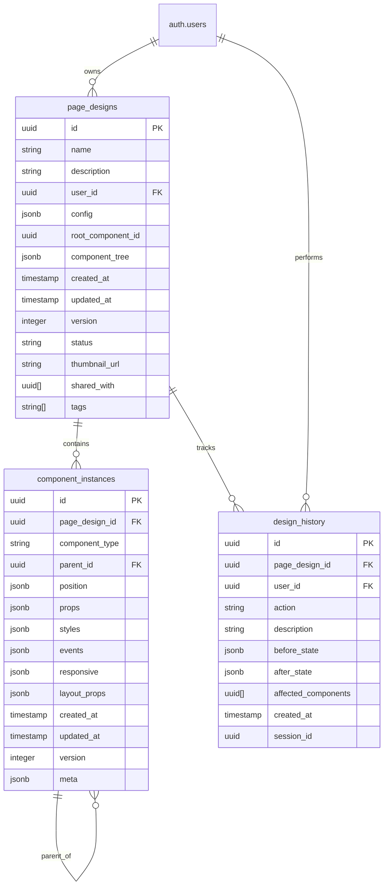

# 基础页面设计器数据模型设计

**文档用途**: 定义页面设计器的数据模型和实体关系
**功能模块**: 基础页面设计器 (003-page-designer)
**创建日期**: 2025-10-27
**文档版本**: v1.0

---

## 1. 核心实体定义

### 1.1 页面设计实体 (PageDesign)

表示用户创建的页面布局设计，包含组件树结构和样式配置。

```typescript
interface PageDesign {
  id: string // 页面设计唯一标识
  name: string // 页面名称
  description?: string // 页面描述
  user_id: string // 创建者ID (外键 -> auth.users.id)

  // 页面配置
  config: {
    title: string // 页面标题
    meta: {
      description?: string // SEO描述
      keywords?: string[] // SEO关键词
      author?: string // 作者
    }
    styles: {
      theme: 'light' | 'dark' | 'auto' // 主题模式
      backgroundColor?: string // 背景色
      backgroundImage?: string // 背景图
      spacing: 'compact' | 'normal' | 'relaxed' // 间距模式
    }
    layout: {
      maxWidth?: number // 最大宽度
      padding: { top: number; right: number; bottom: number; left: number }
      centered: boolean // 是否居中
    }
  }

  // 组件树结构
  root_component_id: string // 根组件ID
  component_tree: ComponentTree // 组件树数据结构

  // 系统字段
  created_at: string // 创建时间
  updated_at: string // 更新时间
  version: number // 版本号（用于乐观锁）
  status: 'draft' | 'published' | 'archived' // 状态
  thumbnail_url?: string // 缩略图URL

  // 协作字段
  shared_with: string[] // 共享用户ID列表
  tags: string[] // 标签
}
```

### 1.2 组件实例实体 (ComponentInstance)

画布上的具体组件实例，包含类型、属性、位置和层级关系。

```typescript
interface ComponentInstance {
  id: string // 组件实例唯一标识
  page_design_id: string // 所属页面设计ID (外键)
  component_type: ComponentType // 组件类型
  parent_id?: string // 父组件ID (外键 -> ComponentInstance.id)

  // 层级和位置
  position: {
    z_index: number // Z轴层级
    order: number // 在父组件中的顺序
  }

  // 组件属性
  props: ComponentProps // 组件特定属性
  styles: ComponentStyles // 样式属性
  events: ComponentEvents // 事件处理配置

  // 响应式配置
  responsive: {
    [breakpoint in Breakpoint]?: {
      props?: Partial<ComponentProps>
      styles?: Partial<ComponentStyles>
      visible?: boolean
    }
  }

  // 布局属性（仅对布局组件有效）
  layout_props?: {
    // Container属性
    container?: {
      direction: 'row' | 'col'
      wrap: boolean
      justify: 'start' | 'center' | 'end' | 'between' | 'around' | 'evenly'
      align: 'start' | 'center' | 'end' | 'stretch'
      gap: number
    }

    // Row属性
    row?: {
      wrap: boolean
      justify: 'start' | 'center' | 'end' | 'between' | 'around' | 'evenly'
      align: 'start' | 'center' | 'end' | 'stretch'
      gap: number
    }

    // Col属性
    col?: {
      span: number | { [breakpoint in Breakpoint]?: number }
      offset?: number | { [breakpoint in Breakpoint]?: number }
      order?: number
    }
  }

  // 系统字段
  created_at: string
  updated_at: string
  version: number

  // 元数据
  meta: {
    locked: boolean // 是否锁定编辑
    hidden: boolean // 是否隐藏
    custom_name?: string // 自定义名称
    notes?: string // 备注
  }
}
```

### 1.3 组件类型定义 (ComponentType)

```typescript
type ComponentType =
  // 基础组件
  | 'button'
  | 'input'
  | 'text'
  | 'image'
  | 'link'
  | 'heading'
  | 'paragraph'
  | 'divider'
  | 'spacer'

  // 布局组件
  | 'container'
  | 'row'
  | 'col'

  // 表单组件
  | 'form'
  | 'textarea'
  | 'select'
  | 'checkbox'
  | 'radio'

  // 导航组件
  | 'navbar'
  | 'sidebar'
  | 'breadcrumb'
  | 'tabs'

  // 列表组件
  | 'list'
  | 'table'
  | 'card'
  | 'grid'

// 组件属性类型定义
type ComponentProps = {
  // Button属性
  button?: {
    text: string
    variant: 'primary' | 'secondary' | 'outline' | 'ghost' | 'link'
    size: 'sm' | 'md' | 'lg'
    disabled?: boolean
    loading?: boolean
    icon?: string
    icon_position?: 'left' | 'right'
    onClick?: string // 事件处理ID
  }

  // Input属性
  input?: {
    placeholder?: string
    value?: string
    type: 'text' | 'email' | 'password' | 'number' | 'tel' | 'url'
    required?: boolean
    disabled?: boolean
    readonly?: boolean
    maxlength?: number
    minlength?: number
    pattern?: string
    label?: string
    error?: string
    helper?: string
  }

  // Text属性
  text?: {
    content: string
    variant: 'body' | 'heading1' | 'heading2' | 'heading3' | 'heading4' | 'heading5' | 'heading6'
    weight?: 'normal' | 'medium' | 'semibold' | 'bold'
    size?: 'xs' | 'sm' | 'base' | 'lg' | 'xl' | '2xl' | '3xl' | '4xl'
    color?: string
    align?: 'left' | 'center' | 'right' | 'justify'
    decoration?: 'none' | 'underline' | 'line-through'
  }

  // Image属性
  image?: {
    src: string
    alt?: string
    width?: number | 'auto'
    height?: number | 'auto'
    object_fit?: 'cover' | 'contain' | 'fill' | 'none' | 'scale-down'
    rounded?: boolean
    shadow?: boolean
    loading?: 'lazy' | 'eager'
  }

  // Container属性
  container?: {
    padding?: SpacingValue
    margin?: SpacingValue
    background?: BackgroundValue
    border?: BorderValue
    shadow?: ShadowValue
    rounded?: RoundedValue
  }

  // Row属性
  row?: {
    gap?: SpacingValue
    padding?: SpacingValue
    margin?: SpacingValue
    wrap?: boolean
  }

  // Col属性
  col?: {
    span?: number
    offset?: number
    padding?: SpacingValue
    margin?: SpacingValue
  }

  // 通用属性
  [key: string]: any
}
```

### 1.4 样式类型定义

```typescript
type SpacingValue =
  | number
  | { x?: number; y?: number; top?: number; right?: number; bottom?: number; left?: number }

type BackgroundValue =
  | string
  | {
      color?: string
      image?: string
      size?: 'cover' | 'contain' | 'auto'
      position?: string
      repeat?: 'repeat' | 'no-repeat' | 'repeat-x' | 'repeat-y'
    }

type BorderValue =
  | boolean
  | {
      width?: number
      color?: string
      style?: 'solid' | 'dashed' | 'dotted' | 'double'
      side?: 'all' | 'top' | 'right' | 'bottom' | 'left' | 'x' | 'y'
    }

type ShadowValue = boolean | 'sm' | 'md' | 'lg' | 'xl' | '2xl' | 'inner'

type RoundedValue = boolean | 'none' | 'sm' | 'md' | 'lg' | 'xl' | '2xl' | '3xl' | 'full'

type ComponentStyles = {
  // 尺寸
  width?: string | number
  height?: string | number
  minWidth?: string | number
  minHeight?: string | number
  maxWidth?: string | number
  maxHeight?: string | number

  // 间距
  margin?: SpacingValue
  padding?: SpacingValue

  // 定位
  position?: 'static' | 'relative' | 'absolute' | 'fixed' | 'sticky'
  top?: string | number
  right?: string | number
  bottom?: string | number
  left?: string | number
  zIndex?: number

  // 显示和布局
  display?: 'block' | 'inline' | 'inline-block' | 'flex' | 'grid' | 'none'
  flex?: {
    grow?: number
    shrink?: number
    basis?: string | number
    direction?: 'row' | 'column' | 'row-reverse' | 'column-reverse'
    wrap?: 'nowrap' | 'wrap' | 'wrap-reverse'
    justify?: 'start' | 'center' | 'end' | 'between' | 'around' | 'evenly'
    align?: 'start' | 'center' | 'end' | 'stretch' | 'baseline'
    gap?: string | number
  }
  grid?: {
    columns?: string
    rows?: string
    areas?: string
    gap?: string | number
  }

  // 背景
  background?: BackgroundValue

  // 边框
  border?: BorderValue
  borderRadius?: RoundedValue

  // 阴影
  boxShadow?: ShadowValue

  // 文字样式
  color?: string
  fontSize?: string | number
  fontWeight?: string | number
  fontFamily?: string
  textAlign?: 'left' | 'center' | 'right' | 'justify'
  textDecoration?: string
  textTransform?: string
  lineHeight?: string | number

  // 透明度
  opacity?: number

  // 过渡
  transition?: string

  // 自定义CSS
  customCSS?: string
}
```

### 1.5 事件处理定义

```typescript
type ComponentEvents = {
  [eventType: string]: EventHandlerConfig
}

type EventHandlerConfig = {
  id: string // 事件处理唯一标识
  type: EventType // 事件类型
  action: EventAction // 执行动作
  enabled: boolean
  conditions?: EventCondition[] // 执行条件
}

type EventType = 'click' | 'change' | 'submit' | 'focus' | 'blur' | 'hover' | 'load' | 'scroll'

type EventAction =
  | { type: 'navigate'; to: string }
  | { type: 'api'; method: 'GET' | 'POST' | 'PUT' | 'DELETE'; url: string; data?: any }
  | { type: 'setState'; state: Record<string, any> }
  | { type: 'showMessage'; message: string; variant?: 'success' | 'error' | 'warning' | 'info' }
  | { type: 'component'; action: 'show' | 'hide' | 'enable' | 'disable'; target: string }
  | { type: 'custom'; code: string } // 自定义JavaScript代码

type EventCondition = {
  type: 'component' | 'state' | 'form'
  operator: 'equals' | 'not_equals' | 'contains' | 'not_contains' | 'greater_than' | 'less_than'
  field: string
  value: any
}
```

### 1.6 组件树结构

```typescript
interface ComponentTree {
  version: string // 树结构版本
  root_id: string // 根组件ID
  components: Map<string, ComponentInstance> // 所有组件实例
  hierarchy: HierarchyNode[] // 层级关系
}

interface HierarchyNode {
  component_id: string
  parent_id?: string
  children: string[] // 子组件ID列表
  depth: number // 层级深度
  path: string // 组件路径 (如: "root.0.1.2")
}
```

### 1.7 设计历史实体 (DesignHistory)

记录用户的设计操作历史，支持撤销和重做功能。

```typescript
interface DesignHistory {
  id: string // 历史记录唯一标识
  page_design_id: string // 页面设计ID (外键)
  user_id: string // 操作用户ID (外键 -> auth.users.id)

  // 操作信息
  action: HistoryAction // 操作类型
  description: string // 操作描述

  // 状态快照
  before_state: ComponentTree // 操作前状态
  after_state: ComponentTree // 操作后状态

  // 影响的组件
  affected_components: string[] // 受影响的组件ID列表

  // 系统字段
  created_at: string
  session_id?: string // 会话ID（用于批量操作）
}

type HistoryAction =
  | 'create_component'
  | 'update_component'
  | 'delete_component'
  | 'move_component'
  | 'copy_component'
  | 'paste_component'
  | 'undo'
  | 'redo'
  | 'batch_operation'
```

### 1.8 响应式断点定义

```typescript
type Breakpoint = 'xs' | 'sm' | 'md' | 'lg' | 'xl' | '2xl'

interface BreakpointConfig {
  name: Breakpoint
  min_width: number // 最小宽度 (px)
  max_width?: number // 最大宽度 (px)
  container_max_width?: number // 容器最大宽度 (px)
  columns?: number // 栅格列数
  gutter?: number // 栅格间距 (px)
}

const BREAKPOINTS: Record<Breakpoint, BreakpointConfig> = {
  xs: {
    name: 'xs',
    min_width: 0,
    max_width: 639,
    container_max_width: 100,
    columns: 4,
    gutter: 16,
  },
  sm: {
    name: 'sm',
    min_width: 640,
    max_width: 767,
    container_max_width: 640,
    columns: 8,
    gutter: 16,
  },
  md: {
    name: 'md',
    min_width: 768,
    max_width: 1023,
    container_max_width: 768,
    columns: 12,
    gutter: 24,
  },
  lg: {
    name: 'lg',
    min_width: 1024,
    max_width: 1279,
    container_max_width: 1024,
    columns: 12,
    gutter: 24,
  },
  xl: {
    name: 'xl',
    min_width: 1280,
    max_width: 1535,
    container_max_width: 1280,
    columns: 12,
    gutter: 24,
  },
  '2xl': { name: '2xl', min_width: 1536, container_max_width: 1536, columns: 12, gutter: 32 },
}
```

## 2. 数据库表结构设计

### 2.1 页面设计表 (page_designs)

```sql
CREATE TABLE page_designs (
  id UUID PRIMARY KEY DEFAULT gen_random_uuid(),
  name VARCHAR(255) NOT NULL,
  description TEXT,
  user_id UUID NOT NULL REFERENCES auth.users(id) ON DELETE CASCADE,

  -- 页面配置 (JSONB)
  config JSONB NOT NULL DEFAULT '{}',

  -- 组件树结构
  root_component_id UUID NOT NULL,
  component_tree JSONB NOT NULL DEFAULT '{}',

  -- 系统字段
  created_at TIMESTAMPTZ DEFAULT NOW(),
  updated_at TIMESTAMPTZ DEFAULT NOW(),
  version INTEGER NOT NULL DEFAULT 1,
  status VARCHAR(20) NOT NULL DEFAULT 'draft' CHECK (status IN ('draft', 'published', 'archived')),
  thumbnail_url TEXT,

  -- 协作字段
  shared_with UUID[] DEFAULT '{}',
  tags TEXT[] DEFAULT '{}',

  -- 约束
  CONSTRAINT page_designs_name_user_unique UNIQUE(name, user_id),
  CONSTRAINT page_designs_version_positive CHECK (version > 0)
);

-- 索引
CREATE INDEX idx_page_designs_user_id ON page_designs(user_id);
CREATE INDEX idx_page_designs_status ON page_designs(status);
CREATE INDEX idx_page_designs_created_at ON page_designs(created_at DESC);
CREATE INDEX idx_page_designs_tags ON page_designs USING GIN(tags);
CREATE INDEX idx_page_designs_shared_with ON page_designs USING GIN(shared_with);
```

### 2.2 组件实例表 (component_instances)

```sql
CREATE TABLE component_instances (
  id UUID PRIMARY KEY DEFAULT gen_random_uuid(),
  page_design_id UUID NOT NULL REFERENCES page_designs(id) ON DELETE CASCADE,
  component_type VARCHAR(50) NOT NULL,
  parent_id UUID REFERENCES component_instances(id) ON DELETE CASCADE,

  -- 层级和位置
  position JSONB NOT NULL DEFAULT '{"z_index": 0, "order": 0}',

  -- 组件属性
  props JSONB NOT NULL DEFAULT '{}',
  styles JSONB NOT NULL DEFAULT '{}',
  events JSONB NOT NULL DEFAULT '{}',

  -- 响应式配置
  responsive JSONB NOT NULL DEFAULT '{}',

  -- 布局属性
  layout_props JSONB,

  -- 系统字段
  created_at TIMESTAMPTZ DEFAULT NOW(),
  updated_at TIMESTAMPTZ DEFAULT NOW(),
  version INTEGER NOT NULL DEFAULT 1,

  -- 元数据
  meta JSONB NOT NULL DEFAULT '{"locked": false, "hidden": false}',

  -- 约束
  CONSTRAINT component_instances_valid_type CHECK (
    component_type IN (
      'button', 'input', 'text', 'image', 'link', 'heading', 'paragraph', 'divider', 'spacer',
      'container', 'row', 'col',
      'form', 'textarea', 'select', 'checkbox', 'radio',
      'navbar', 'sidebar', 'breadcrumb', 'tabs',
      'list', 'table', 'card', 'grid'
    )
  ),
  CONSTRAINT component_instances_version_positive CHECK (version > 0),
  CONSTRAINT component_instances_order_positive CHECK ((position->>'order')::integer >= 0)
);

-- 索引
CREATE INDEX idx_component_instances_page_design_id ON component_instances(page_design_id);
CREATE INDEX idx_component_instances_parent_id ON component_instances(parent_id);
CREATE INDEX idx_component_instances_type ON component_instances(component_type);
CREATE INDEX idx_component_instances_position ON component_instances USING GIN(position);
```

### 2.3 设计历史表 (design_history)

```sql
CREATE TABLE design_history (
  id UUID PRIMARY KEY DEFAULT gen_random_uuid(),
  page_design_id UUID NOT NULL REFERENCES page_designs(id) ON DELETE CASCADE,
  user_id UUID NOT NULL REFERENCES auth.users(id) ON DELETE CASCADE,

  -- 操作信息
  action VARCHAR(50) NOT NULL,
  description TEXT NOT NULL,

  -- 状态快照
  before_state JSONB NOT NULL,
  after_state JSONB NOT NULL,

  -- 影响的组件
  affected_components UUID[] DEFAULT '{}',

  -- 系统字段
  created_at TIMESTAMPTZ DEFAULT NOW(),
  session_id UUID,

  -- 约束
  CONSTRAINT design_history_valid_action CHECK (
    action IN (
      'create_component', 'update_component', 'delete_component',
      'move_component', 'copy_component', 'paste_component',
      'undo', 'redo', 'batch_operation'
    )
  )
);

-- 索引
CREATE INDEX idx_design_history_page_design_id ON design_history(page_design_id);
CREATE INDEX idx_design_history_user_id ON design_history(user_id);
CREATE INDEX idx_design_history_created_at ON design_history(created_at DESC);
CREATE INDEX idx_design_history_session_id ON design_history(session_id);
```

## 3. RLS权限策略设计

### 3.1 页面设计表权限策略

```sql
-- 启用RLS
ALTER TABLE page_designs ENABLE ROW LEVEL SECURITY;

-- 用户可以查看自己的页面设计
CREATE POLICY "Users can view own page designs" ON page_designs
  FOR SELECT USING (auth.uid() = user_id);

-- 用户可以查看被共享的页面设计
CREATE POLICY "Users can view shared page designs" ON page_designs
  FOR SELECT USING (auth.uid() = ANY(shared_with));

-- 用户可以创建自己的页面设计
CREATE POLICY "Users can create own page designs" ON page_designs
  FOR INSERT WITH CHECK (auth.uid() = user_id);

-- 用户可以更新自己的页面设计
CREATE POLICY "Users can update own page designs" ON page_designs
  FOR UPDATE USING (auth.uid() = user_id);

-- 用户可以删除自己的页面设计
CREATE POLICY "Users can delete own page designs" ON page_designs
  FOR DELETE USING (auth.uid() = user_id);
```

### 3.2 组件实例表权限策略

```sql
-- 启用RLS
ALTER TABLE component_instances ENABLE ROW LEVEL SECURITY;

-- 通过页面设计控制访问权限
CREATE POLICY "Component access via page design" ON component_instances
  FOR ALL USING (
    page_design_id IN (
      SELECT id FROM page_designs
      WHERE auth.uid() = user_id OR auth.uid() = ANY(shared_with)
    )
  );
```

### 3.3 设计历史表权限策略

```sql
-- 启用RLS
ALTER TABLE design_history ENABLE ROW LEVEL SECURITY;

-- 通过页面设计控制访问权限
CREATE POLICY "History access via page design" ON design_history
  FOR ALL USING (
    page_design_id IN (
      SELECT id FROM page_designs
      WHERE auth.uid() = user_id OR auth.uid() = ANY(shared_with)
    )
  );
```

## 4. 实体关系图



## 5. 数据验证规则

### 5.1 组件实例验证

```typescript
// 组件属性验证器
const componentValidators = {
  button: (props: any) => ({
    text: typeof props.text === 'string' && props.text.length > 0,
    variant: ['primary', 'secondary', 'outline', 'ghost', 'link'].includes(props.variant),
    size: ['sm', 'md', 'lg'].includes(props.size),
  }),

  input: (props: any) => ({
    type: ['text', 'email', 'password', 'number', 'tel', 'url'].includes(props.type),
    required: typeof props.required === 'boolean',
    maxlength:
      props.maxlength === undefined || (typeof props.maxlength === 'number' && props.maxlength > 0),
  }),

  container: (props: any) => ({
    direction: ['row', 'col'].includes(props.direction),
    wrap: typeof props.wrap === 'boolean',
  }),
}

// 布局约束验证
const layoutConstraints = {
  // Container只能包含Row、Col或其他Container
  container: ['container', 'row', 'col'],

  // Row只能包含Col
  row: ['col'],

  // Col可以包含任何组件（除了Row）
  col: ['button', 'input', 'text', 'image', 'container', 'form', 'card', 'grid'],

  // 基础组件不能包含子组件
  leaf: [] as string[],
}
```

### 5.2 响应式配置验证

```typescript
const responsiveValidator = {
  validateBreakpointValues: (responsive: any) => {
    const validBreakpoints = ['xs', 'sm', 'md', 'lg', 'xl', '2xl']

    for (const [breakpoint, config] of Object.entries(responsive)) {
      if (!validBreakpoints.includes(breakpoint)) {
        return false
      }

      if (typeof config !== 'object' || config === null) {
        return false
      }
    }

    return true
  },

  validateSpanValues: (span: any) => {
    if (typeof span === 'number') {
      return span >= 1 && span <= 12
    }

    if (typeof span === 'object') {
      for (const [breakpoint, value] of Object.entries(span)) {
        if (typeof value !== 'number' || value < 1 || value > 12) {
          return false
        }
      }
      return true
    }

    return false
  },
}
```

---

**文档结束**

_注：本数据模型设计基于PostgreSQL和Supabase，充分考虑了扩展性、性能和安全性的平衡。所有表都支持版本控制和软删除，为后续功能扩展提供了良好的基础。_
