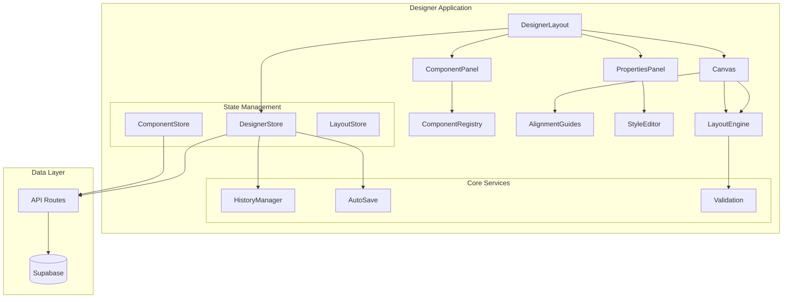
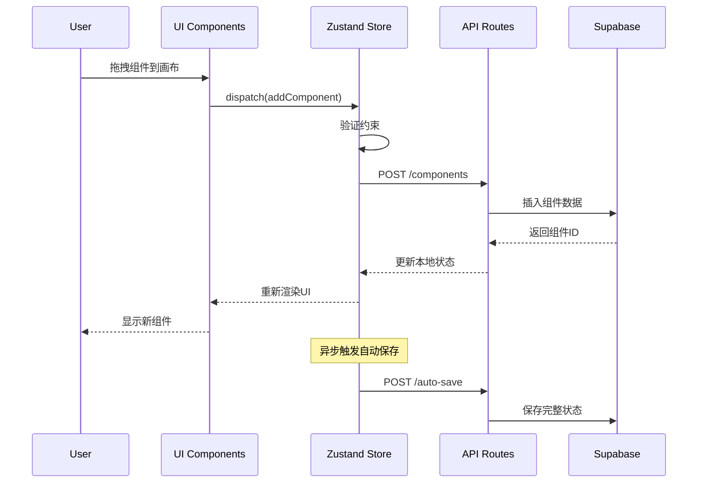

# Implementation Plan: 基础页面设计器

**Branch**: `003-page-designer` | **Date**: 2025-10-27 | **Spec**: [基础页面设计器规格](./spec.md)
**Input**: Feature specification from `/specs/003-page-designer/spec.md`

**Note**: This template is filled in by the `/speckit.plan` command. See `.specify/templates/commands/plan.md` for the execution workflow.

## Summary

基于研究分析，FlowBase基础页面设计器将采用React 19 + @dnd-kit + Zustand的技术栈，实现一个高性能的可视化页面构建工具。核心功能包括组件拖拽、布局管理、实时保存和响应式设计，为用户提供直观的低代码页面开发体验。

## Technical Context

**Language/Version**: TypeScript 5.x (基于Next.js 15配置)
**Primary Dependencies**: Next.js 15, React 19, @dnd-kit, Zustand, Supabase
**Storage**: Supabase PostgreSQL (托管数据库服务)
**Target Platform**: Web浏览器 (Chrome 88+, Firefox 85+, Safari 14+)
**Project Type**: Web application (单页应用)
**Performance Goals**: 拖拽响应时间 <50ms, 页面加载 <3秒, 50个组件时流畅度 >90%
**Constraints**: 支持移动端触摸拖拽, 响应式设计, 自动保存防丢失
**Scale/Scope**: 支持最多500个组件/页面, 1000+并发用户

## Constitution Check

_GATE: Must pass before Phase 0 research. Re-check after Phase 1 design._

### Code Quality Excellence Gates

- [x] TypeScript strict mode compliance confirmed (项目已启用严格模式)
- [x] ESLint configuration covers all code patterns (现有配置完善)
- [x] Prettier formatting enforced in pre-commit hooks (已配置)
- [x] Code organization follows feature-based structure (遵循现有架构)

### Test-First Development Gates

- [ ] Test framework (Jest/Testing Library) configured (需添加)
- [ ] Minimum 80% coverage requirements established (需定义)
- [ ] Integration test strategy defined for user workflows (需制定)
- [ ] E2E test plan for critical user paths (需制定)

### User Experience Consistency Gates

- [x] shadcn/ui design system integration confirmed (项目已集成)
- [x] Accessibility (WCAG 2.1 AA) compliance strategy defined (规格中已定义)
- [x] Responsive design breakpoints established (断点系统已设计)
- [x] User interaction performance thresholds set (性能目标已设定)

### Performance-First Architecture Gates

- [x] Core Web Vitals targets defined (LCP < 2.5s, FID < 100ms, CLS < 0.1)
- [x] Bundle size budgets established (< 250KB gzipped per route)
- [x] Database performance requirements specified (< 100ms query time)
- [x] Performance regression testing approach defined (需要实现)

## Project Structure

### Documentation (this feature)

```
specs/003-page-designer/
├── plan.md              # This file (/speckit.plan command output)
├── research.md          # Phase 0 output (/speckit.plan command)
├── data-model.md        # Phase 1 output (/speckit.plan command)
├── quickstart.md        # Phase 1 output (/speckit.plan command)
├── contracts/           # Phase 1 output (/speckit.plan command)
│   └── openapi.yaml     # API specification
└── tasks.md             # Phase 2 output (/speckit.tasks command - NOT created by /speckit.plan)
```

### Source Code (repository root)

**Structure Decision**: Web application with Next.js App Router, leveraging existing project structure

```
/app/
  /protected/
    /designer/                    # 页面设计器主页面
      /page/
        [id]/                    # 设计器编辑页面 (layout.tsx + page.tsx)
      /list/                     # 页面设计列表 (page.tsx)
      /create/                   # 创建新页面 (page.tsx)

/components/
  /designer/                     # 设计器组件
    ├── DesignerLayout.tsx       # 三栏布局主容器
    ├── ComponentPanel.tsx       # 左侧组件面板
    ├── Canvas.tsx               # 中间设计画布
    ├── PropertiesPanel.tsx      # 右侧属性面板
    ├── DragOverlay.tsx          # 拖拽覆盖层
    ├── AlignmentGuides.tsx      # 对齐辅助线
    ├── MiniMap.tsx              # 小地图组件
    └── Toolbar.tsx              # 工具栏

  /lowcode/                      # 低代码组件库
    /basic/                      # 基础组件
      ├── Button.tsx
      ├── Input.tsx
      ├── Text.tsx
      └── Image.tsx
    /layout/                     # 布局组件
      ├── Container.tsx
      ├── Row.tsx
      └── Col.tsx
    /business/                   # 业务组件
      ├── Form.tsx
      ├── Card.tsx
      └── Grid.tsx

/lib/
  /designer/                    # 设计器核心逻辑
    ├── layout-engine.ts        # 布局引擎
    ├── component-registry.ts   # 组件注册表
    ├── style-system.ts         # 样式系统
    ├── history-manager.ts      # 历史管理器
    ├── validation.ts           # 布局验证器
    └── constraints.ts          # 约束规则

  /stores/                      # Zustand状态管理
    ├── designer-store.ts       # 设计器状态
    ├── component-store.ts      # 组件状态
    └── layout-store.ts         # 布局状态

  /api/                         # API路由
    /designer/                  # 设计器API端点
      ├── page-designs/
      ├── components/
      └── layout/

/hooks/                        # 自定义Hooks
  ├── use-drag-drop.ts         # 拖拽逻辑
  ├── use-layout-engine.ts     # 布局引擎
  ├── use-auto-save.ts         # 自动保存
  ├── use-keyboard-shortcuts.ts # 键盘快捷键
  └── use-responsive-design.ts # 响应式设计

/types/                        # TypeScript类型定义
  ├── designer.ts              # 设计器类型
  ├── component.ts             # 组件类型
  ├── layout.ts                # 布局类型
  └── api.ts                   # API类型

/app/api/designer/             # API路由实现
  ├── page-designs/route.ts
  ├── components/route.ts
  └── layout/route.ts
```

**Integration Notes**:

- 集成现有认证系统：`/app/protected/*` 路由已受保护
- 复用现有UI组件库：基于shadcn/ui组件
- 遵循现有数据层架构：使用Supabase客户端
- 扩展现有状态管理模式：添加Zustand stores

## Complexity Tracking

_Fill ONLY if Constitution Check has violations that must be justified_

| Violation    | Why Needed                     | Simpler Alternative Rejected Because     |
| ------------ | ------------------------------ | ---------------------------------------- |
| 测试策略缺失 | 需要确保拖拽和布局功能的稳定性 | 简单的手动测试无法覆盖复杂的用户交互场景 |
| E2E测试缺失  | 需要验证完整的用户工作流       | 单元测试无法验证端到端的用户体验         |

## Technical Architecture

### Core Components Architecture



### Data Flow Architecture



## Implementation Details

### 1. 拖拽系统实现

**技术选择**: @dnd-kit (已验证为最佳方案)

```typescript
// 核心拖拽配置
const sensors = useSensors(
  useSensor(PointerSensor, {
    activationConstraint: { distance: 8 },
  }),
  useSensor(KeyboardSensor)
)

// 拖拽状态管理
const [dragState, setDragState] = useState({
  isDragging: false,
  activeId: null,
  dragType: 'component' | 'move',
})
```

**关键实现点**:

- 8px拖拽激活距离避免误操作
- 支持键盘导航的无障碍设计
- 触摸设备优化
- 拖拽预览组件

### 2. 布局引擎实现

**核心算法**: Flexbox布局计算 + 约束验证

```typescript
class LayoutEngine {
  validateConstraints(parentId: string, childType: string): boolean {
    const constraints = LAYOUT_CONSTRAINTS[childType]
    const parentType = this.getComponentType(parentId)
    return constraints.allowedParents.includes(parentType)
  }

  calculateLayout(componentId: string): LayoutResult {
    // 递归计算布局
    // 处理响应式断点
    // 生成CSS样式
  }
}
```

**布局约束规则**:

- Container: 可包含所有组件类型
- Row: 只能包含Col组件
- Col: 可包含基础组件和Container
- 基础组件: 不能包含子组件

### 3. 状态管理架构

**Zustand Store设计**:

```typescript
interface DesignerStore {
  // 页面状态
  currentPageId: string | null
  pageDesigns: Record<string, PageDesign>

  // 组件状态
  components: Record<string, ComponentInstance>
  selectedIds: string[]

  // 画布状态
  canvas: CanvasState

  // 历史管理
  history: HistoryState

  // Actions
  addComponent: (component: ComponentInstance) => void
  updateComponent: (id: string, updates: Partial<ComponentInstance>) => void
  deleteComponent: (id: string) => void
  moveComponent: (id: string, newParentId: string, position: number) => void
  undo: () => void
  redo: () => void
}
```

### 4. 性能优化策略

**拖拽性能**:

- 使用React.memo优化组件渲染
- 防抖的位置更新(100ms)
- 虚拟化长组件列表(>50个组件时)

**布局计算优化**:

- 缓存布局计算结果
- 增量更新机制
- Web Worker处理复杂计算

**内存管理**:

- 组件卸载时清理事件监听
- 历史记录限制为50条
- 图片懒加载

### 5. 响应式设计系统

**断点配置**:

```typescript
const BREAKPOINTS = {
  xs: { min: 0, max: 639, container: 100 },
  sm: { min: 640, max: 767, container: 640 },
  md: { min: 768, max: 1023, container: 768 },
  lg: { min: 1024, max: 1279, container: 1024 },
  xl: { min: 1280, container: 1280 },
}
```

**响应式实现**:

- 每个组件支持断点特定的属性配置
- 实时预览不同断点的显示效果
- 自动生成响应式CSS代码

## Development Plan

### Phase 0: 基础设施 (Week 1-2)

**目标**: 搭建项目基础架构

**任务清单**:

- [ ] 设置项目依赖和环境配置
- [ ] 创建数据库表结构和RLS策略
- [ ] 实现基础的Zustand状态管理
- [ ] 搭建API路由框架
- [ ] 配置开发工具和代码规范

**验收标准**:

- 项目可以正常启动和构建
- 数据库表创建成功
- 基础API端点可访问
- TypeScript类型检查通过

### Phase 1: 核心拖拽功能 (Week 3-4)

**目标**: 实现基础的组件拖拽功能

**任务清单**:

- [ ] 实现三栏布局结构 (ComponentPanel + Canvas + PropertiesPanel)
- [ ] 集成@dnd-kit拖拽系统
- [ ] 创建基础组件库 (Button, Input, Text, Image)
- [ ] 实现组件注册表系统
- [ ] 添加基础的拖拽视觉反馈

**验收标准**:

- 用户可以从面板拖拽组件到画布
- 组件在画布上正确显示
- 选中组件时显示属性面板
- 拖拽操作流畅无卡顿

### Phase 2: 布局引擎 (Week 5-6)

**目标**: 实现Container/Row/Col布局系统

**任务清单**:

- [ ] 实现布局引擎核心算法
- [ ] 创建布局组件 (Container, Row, Col)
- [ ] 实现组件嵌套约束验证
- [ ] 添加布局属性编辑功能
- [ ] 实现对齐辅助线系统

**验收标准**:

- 用户可以创建复杂的布局结构
- 布局约束正确执行
- 对齐辅助线准确显示
- 响应式布局正常工作

### Phase 3: 高级功能 (Week 7-8)

**目标**: 实现高级编辑功能

**任务清单**:

- [ ] 实现撤销/重做功能
- [ ] 添加自动保存机制
- [ ] 实现组件复制/粘贴
- [ ] 添加键盘快捷键支持
- [ ] 实现小地图导航

**验收标准**:

- 用户可以撤销和重做操作
- 页面设计自动保存到后端
- 支持复制粘贴组件
- 键盘快捷键正常工作

### Phase 4: 性能优化和测试 (Week 9-10)

**目标**: 性能优化和质量保证

**任务清单**:

- [ ] 性能分析和优化
- [ ] 添加错误边界和异常处理
- [ ] 实现加载状态和骨架屏
- [ ] 编写单元测试和集成测试
- [ ] 进行用户体验测试

**验收标准**:

- 页面加载时间 < 3秒
- 拖拽响应时间 < 50ms
- 50个组件时流畅度 > 90%
- 核心功能测试覆盖率 > 80%

### Phase 5: 发布准备 (Week 11-12)

**目标**: 准备生产环境发布

**任务清单**:

- [ ] 完善文档和用户指南
- [ ] 生产环境部署测试
- [ ] 安全审查和性能调优
- [ ] 用户验收测试
- [ ] 发布和监控设置

**验收标准**:

- 生产环境稳定运行
- 文档完整准确
- 用户反馈积极
- 监控指标正常

## Risk Management

### Technical Risks

| 风险           | 影响 | 概率 | 应对策略                         |
| -------------- | ---- | ---- | -------------------------------- |
| 拖拽性能问题   | 高   | 中   | 提前进行性能测试，准备优化方案   |
| 布局算法复杂度 | 中   | 高   | 分阶段实现，先简单后复杂         |
| 状态管理复杂度 | 中   | 中   | 使用成熟的状态管理模式，充分测试 |
| 浏览器兼容性   | 低   | 低   | 目标现代浏览器，渐进增强         |

### Project Risks

| 风险         | 影响 | 概率 | 应对策略                     |
| ------------ | ---- | ---- | ---------------------------- |
| 开发进度延迟 | 中   | 中   | 分阶段交付，优先核心功能     |
| 用户需求变更 | 中   | 中   | 保持架构灵活性，预留扩展空间 |
| 团队技能不足 | 高   | 低   | 提供培训文档，代码审查       |

## Success Metrics

### 技术指标

- **性能指标**:
  - 页面加载时间: < 3秒
  - 拖拽响应延迟: < 50ms
  - 组件渲染时间: < 16ms (60fps)
  - 内存使用: < 100MB (50个组件)

- **质量指标**:
  - 代码覆盖率: > 80%
  - TypeScript类型覆盖率: 100%
  - ESLint错误数: 0
  - 构建成功率: 100%

### 用户体验指标

- **易用性指标**:
  - 新用户完成第一个页面时间: < 5分钟
  - 拖拽成功率: > 95%
  - 错误率: < 5%
  - 用户满意度: > 4.0/5.0

- **功能指标**:
  - 支持组件类型: > 15种
  - 最大嵌套层级: 10层
  - 自动保存间隔: 30秒
  - 历史记录容量: 50条

## Next Steps

1. **立即行动** (本周):
   - 创建开发分支
   - 安装和配置依赖
   - 设置开发环境

2. **短期目标** (2周内):
   - 完成Phase 0基础设施
   - 实现基础三栏布局
   - 创建第一个可拖拽组件

3. **中期目标** (1个月内):
   - 完成核心拖拽功能
   - 实现布局引擎
   - 基础功能可用

4. **长期目标** (3个月内):
   - 完成所有规划功能
   - 通过性能测试
   - 正式发布1.0版本

---

**Implementation Plan End**

_此规划基于技术研究和可行性分析制定，为FlowBase基础页面设计器的开发提供详细的技术路线图和实施计划。_
